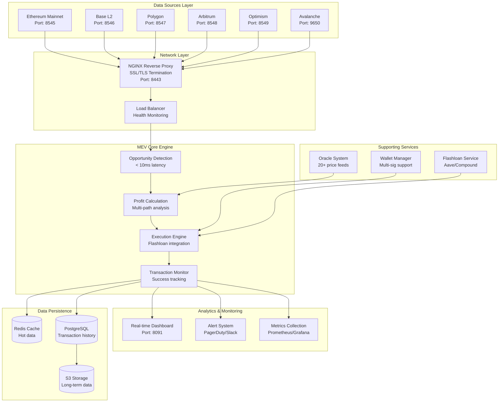

# Technical Architecture Documentation
**Version**: 2.0  
**Last Updated**: July 11, 2025  
**Classification**: Technical Documentation  
**Standard**: TOGAF/IEEE 1471

---

## 🏗️ System Architecture Overview

### High-Level Architecture



---

## 🔧 Component Architecture

### 1. Blockchain Infrastructure Layer

#### Node Configuration
| Network | Node Type | Version | Sync Mode | Resource Allocation |
|---------|-----------|---------|-----------|-------------------|
| Ethereum | Erigon | v2.60.0 | Full Archive | 64GB RAM, 4TB NVMe |
| Base | op-geth | v1.101315.2 | Full | 32GB RAM, 2TB NVMe |
| Polygon | Bor | v1.3.7 | Full | 32GB RAM, 2TB NVMe |
| Arbitrum | Nitro | v3.1.1 | Full | 32GB RAM, 1TB NVMe |
| Optimism | op-geth | v1.101315.2 | Full | 32GB RAM, 2TB NVMe |
| Avalanche | AvalancheGo | v1.11.11 | Full | 16GB RAM, 1TB NVMe |

#### Network Topology
```
┌─────────────────────────────────────────────────────────────┐
│                    Primary Data Center                       │
├─────────────────────────────────────────────────────────────┤
│  ┌─────────────┐  ┌─────────────┐  ┌─────────────┐        │
│  │  Primary    │  │  Secondary  │  │  Tertiary   │        │
│  │  Ethereum   │  │  Ethereum   │  │  Ethereum   │        │
│  │  Node       │  │  Node       │  │  Node       │        │
│  └─────────────┘  └─────────────┘  └─────────────┘        │
│         │                │                │                 │
│         └────────────────┴────────────────┘                 │
│                         │                                   │
│                   Load Balancer                             │
│                         │                                   │
│  ┌──────────────────────┴──────────────────────┐          │
│  │            MEV Detection Engine              │          │
│  └──────────────────────────────────────────────┘          │
└─────────────────────────────────────────────────────────────┘
```

### 2. MEV Core Engine Architecture

#### Detection Pipeline
```python
class MEVDetectionPipeline:
    """
    Multi-stage detection pipeline with parallel processing
    """
    
    def __init__(self):
        self.stages = [
            MemPoolMonitor(),      # Stage 1: Monitor pending transactions
            OpportunityDetector(), # Stage 2: Identify MEV opportunities
            ProfitCalculator(),    # Stage 3: Calculate potential profits
            RiskAssessor(),        # Stage 4: Assess execution risks
            StrategySelector()     # Stage 5: Select optimal strategy
        ]
    
    async def process(self, block_data):
        # Parallel processing with asyncio
        results = await asyncio.gather(*[
            stage.process(block_data) for stage in self.stages
        ])
        return self.aggregate_results(results)
```

#### Execution Architecture
```
┌─────────────────────────────────────────────────────────────┐
│                    Execution Engine                          │
├─────────────────────────────────────────────────────────────┤
│                                                             │
│  ┌─────────────┐  ┌─────────────┐  ┌─────────────┐        │
│  │  Strategy   │  │  Transaction │  │   Gas       │        │
│  │  Executor   │  │   Builder    │  │  Optimizer  │        │
│  └─────────────┘  └─────────────┘  └─────────────┘        │
│         │                │                │                 │
│         └────────────────┴────────────────┘                 │
│                         │                                   │
│                 ┌───────┴────────┐                         │
│                 │  Flashloan     │                         │
│                 │  Aggregator    │                         │
│                 └────────────────┘                         │
│                         │                                   │
│  ┌──────────────────────┴──────────────────────┐          │
│  │            Transaction Submitter             │          │
│  └──────────────────────────────────────────────┘          │
└─────────────────────────────────────────────────────────────┘
```

### 3. Data Flow Architecture

#### Real-time Data Pipeline
```
Block Data → WebSocket → Event Parser → Opportunity Detector
    ↓           ↓            ↓               ↓
  Cache      Metrics    Alert System    Execution Queue
    ↓           ↓            ↓               ↓
  Redis    Prometheus    PagerDuty      Strategy Engine
```

#### Transaction Lifecycle
1. **Detection Phase** (0-10ms)
   - Monitor mempool for pending transactions
   - Identify MEV opportunities
   - Calculate potential profit

2. **Analysis Phase** (10-20ms)
   - Simulate transaction execution
   - Assess competition and risks
   - Determine optimal gas price

3. **Execution Phase** (20-50ms)
   - Build optimized transaction
   - Submit to multiple endpoints
   - Monitor for inclusion

4. **Confirmation Phase** (50ms+)
   - Track transaction status
   - Record results
   - Update analytics

### 4. Security Architecture

#### Multi-Layer Security Model
```
┌─────────────────────────────────────────────────────────────┐
│                    Security Layers                           │
├─────────────────────────────────────────────────────────────┤
│                                                             │
│  Layer 1: Network Security                                  │
│  ├─ Firewall (iptables/nftables)                          │
│  ├─ DDoS Protection (Cloudflare)                          │
│  └─ VPN Access (WireGuard)                                │
│                                                             │
│  Layer 2: Application Security                              │
│  ├─ API Authentication (JWT)                               │
│  ├─ Rate Limiting (Redis)                                  │
│  └─ Input Validation (OWASP)                              │
│                                                             │
│  Layer 3: Data Security                                     │
│  ├─ Encryption at Rest (AES-256)                          │
│  ├─ Encryption in Transit (TLS 1.3)                       │
│  └─ Key Management (HashiCorp Vault)                      │
│                                                             │
│  Layer 4: Access Control                                    │
│  ├─ Multi-Factor Authentication                            │
│  ├─ Role-Based Access Control                             │
│  └─ Audit Logging (ELK Stack)                             │
│                                                             │
└─────────────────────────────────────────────────────────────┘
```

### 5. Performance Optimization

#### Latency Optimization Techniques
1. **Memory-Mapped I/O**: Direct memory access for block data
2. **Zero-Copy Networking**: Kernel bypass for packet processing
3. **NUMA Optimization**: CPU affinity for critical processes
4. **JIT Compilation**: Runtime optimization for hot paths

#### Resource Allocation Strategy
```yaml
resource_allocation:
  cpu:
    detection_engine: 
      cores: 8
      priority: real-time
    execution_engine:
      cores: 4
      priority: high
    analytics:
      cores: 2
      priority: normal
  
  memory:
    total: 256GB
    detection_cache: 64GB
    execution_buffer: 32GB
    analytics_db: 16GB
    system_reserve: 144GB
  
  network:
    bandwidth: 10Gbps
    latency_target: <1ms
    packet_priority: highest
```

### 6. Monitoring & Observability

#### Metrics Collection Architecture
```
Application Metrics → StatsD → Prometheus → Grafana
     ↓                  ↓          ↓           ↓
Custom Metrics    Aggregation   Storage   Visualization
     ↓                  ↓          ↓           ↓
Business KPIs      Alerting    Retention   Dashboards
```

#### Key Performance Indicators
- **Technical KPIs**
  - P99 Detection Latency: <10ms
  - Transaction Success Rate: >85%
  - System Uptime: >99.9%
  - API Response Time: <50ms

- **Business KPIs**
  - Revenue per Block
  - Profit Margin per Trade
  - Opportunity Coverage Rate
  - Competition Win Rate

### 7. Disaster Recovery Architecture

#### Backup Strategy
```
Primary Site (US-East)
    ↓ Real-time Replication
Secondary Site (US-West)
    ↓ Hourly Snapshots
Cold Storage (S3 Glacier)
```

#### Recovery Procedures
1. **RTO (Recovery Time Objective)**: 15 minutes
2. **RPO (Recovery Point Objective)**: 1 minute
3. **Automated Failover**: DNS-based with health checks
4. **Data Consistency**: Event sourcing with checkpoints

---

## 🔌 Integration Architecture

### API Gateway Design
```
┌─────────────────────────────────────────────────────────────┐
│                    API Gateway (Kong)                        │
├─────────────────────────────────────────────────────────────┤
│                                                             │
│  ┌─────────────┐  ┌─────────────┐  ┌─────────────┐        │
│  │   REST API  │  │ WebSocket   │  │   GraphQL   │        │
│  │   v2.0      │  │   Server    │  │   Endpoint  │        │
│  └─────────────┘  └─────────────┘  └─────────────┘        │
│         │                │                │                 │
│         └────────────────┴────────────────┘                 │
│                         │                                   │
│                 ┌───────┴────────┐                         │
│                 │ Authentication │                         │
│                 │    Layer       │                         │
│                 └────────────────┘                         │
│                         │                                   │
│  ┌──────────────────────┴──────────────────────┐          │
│  │            Service Mesh (Istio)              │          │
│  └──────────────────────────────────────────────┘          │
└─────────────────────────────────────────────────────────────┘
```

### External Service Integration
- **Oracle Providers**: Chainlink, Band Protocol, UMA
- **Flashloan Providers**: Aave, Compound, dYdX
- **DEX Integrations**: Uniswap, Sushiswap, Curve
- **Notification Services**: PagerDuty, Slack, Email

---

## 🚀 Deployment Architecture

### Container Orchestration
```yaml
apiVersion: apps/v1
kind: Deployment
metadata:
  name: mev-detection-engine
spec:
  replicas: 3
  strategy:
    type: RollingUpdate
    rollingUpdate:
      maxSurge: 1
      maxUnavailable: 0
  template:
    spec:
      containers:
      - name: detection-engine
        image: mev/detection:v2.0
        resources:
          requests:
            memory: "16Gi"
            cpu: "4"
          limits:
            memory: "32Gi"
            cpu: "8"
```

### CI/CD Pipeline
```
Code Commit → GitHub Actions → Build → Test → Security Scan
     ↓             ↓            ↓       ↓          ↓
  Webhook     Container     Unit    Integration  Snyk
     ↓          Build      Tests     Tests     Analysis
     ↓             ↓            ↓       ↓          ↓
Deploy Dev → Deploy Staging → Deploy Production → Monitor
```

---

## 📊 Capacity Planning

### Scalability Model
| Load Level | TPS | Nodes | CPU | Memory | Storage |
|------------|-----|-------|-----|--------|---------|
| Current | 1,000 | 6 | 24 cores | 256GB | 10TB |
| 6 months | 5,000 | 10 | 80 cores | 512GB | 25TB |
| 1 year | 10,000 | 20 | 160 cores | 1TB | 50TB |
| 2 years | 25,000 | 50 | 400 cores | 2.5TB | 125TB |

### Growth Architecture
- **Horizontal Scaling**: Kubernetes-based auto-scaling
- **Vertical Scaling**: GPU acceleration for complex calculations
- **Geographic Distribution**: Multi-region deployment
- **Edge Computing**: Local MEV detection nodes

---

*This technical architecture documentation provides a comprehensive view of the MEV infrastructure's design, components, and operational characteristics following enterprise architecture standards.*