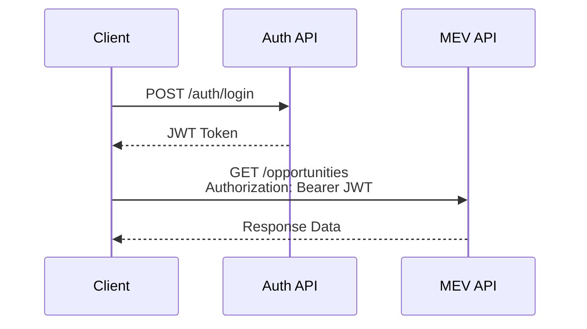

# API Documentation: MEV Infrastructure
**Version**: 2.0  
**Last Updated**: July 11, 2025  
**Classification**: Technical Documentation  
**Standard**: OpenAPI 3.0 / REST API Design

---

## 📋 Table of Contents

1. [API Overview](#api-overview)
2. [Authentication](#authentication)
3. [Core MEV APIs](#core-mev-apis)
4. [Monitoring APIs](#monitoring-apis)
5. [Analytics APIs](#analytics-apis)
6. [WebSocket APIs](#websocket-apis)
7. [Error Handling](#error-handling)
8. [Rate Limiting](#rate-limiting)
9. [SDK Examples](#sdk-examples)

---

## 🌐 API Overview

### Base URLs

| Environment | Base URL | Purpose |
|-------------|----------|---------|
| Production | `https://api.mev.company.com/v2` | Live trading |
| Staging | `https://staging-api.mev.company.com/v2` | Testing |
| Development | `http://localhost:8090/v2` | Local development |

### API Standards

- **Protocol**: HTTPS (TLS 1.3)
- **Format**: JSON (application/json)
- **Versioning**: URL path versioning (/v2/)
- **Pagination**: Cursor-based
- **Timestamps**: ISO 8601 (UTC)

---

## 🔐 Authentication

### API Key Authentication

```http
GET /api/v2/opportunities HTTP/1.1
Host: api.mev.company.com
Authorization: Bearer YOUR_API_KEY
Content-Type: application/json
```

### JWT Token Flow



### Authentication Endpoints

#### Login
```http
POST /api/v2/auth/login
Content-Type: application/json

{
  "username": "trader@company.com",
  "password": "secure_password",
  "totp_code": "123456"
}

Response: 200 OK
{
  "token": "eyJhbGciOiJIUzI1NiIs...",
  "expires_at": "2025-07-11T12:00:00Z",
  "refresh_token": "refresh_token_here"
}
```

#### Refresh Token
```http
POST /api/v2/auth/refresh
Content-Type: application/json

{
  "refresh_token": "refresh_token_here"
}

Response: 200 OK
{
  "token": "new_jwt_token",
  "expires_at": "2025-07-11T13:00:00Z"
}
```

---

## 📊 Core MEV APIs

### 1. Opportunity Detection

#### List MEV Opportunities
```http
GET /api/v2/opportunities
Authorization: Bearer YOUR_TOKEN

Query Parameters:
- chain: ethereum|base|polygon|arbitrum|optimism (required)
- type: arbitrage|liquidation|sandwich|backrun (optional)
- min_profit: decimal (optional, default: 0.01)
- limit: integer (optional, default: 100, max: 1000)
- cursor: string (optional, for pagination)

Response: 200 OK
{
  "data": [
    {
      "id": "opp_123456789",
      "chain": "ethereum",
      "type": "arbitrage",
      "detected_at": "2025-07-11T10:30:45.123Z",
      "profit_estimate": {
        "amount": "0.125",
        "token": "ETH",
        "usd_value": "412.50"
      },
      "gas_estimate": {
        "amount": "0.015",
        "token": "ETH",
        "usd_value": "49.50"
      },
      "net_profit": {
        "amount": "0.110",
        "token": "ETH",
        "usd_value": "363.00"
      },
      "confidence_score": 0.92,
      "competition_level": "medium",
      "execution_window": {
        "start": "2025-07-11T10:30:45.123Z",
        "end": "2025-07-11T10:30:47.123Z"
      },
      "path": [
        {
          "action": "swap",
          "protocol": "uniswap_v3",
          "from_token": "USDC",
          "to_token": "ETH",
          "amount": "10000"
        },
        {
          "action": "swap",
          "protocol": "sushiswap",
          "from_token": "ETH",
          "to_token": "USDC",
          "amount": "3.215"
        }
      ]
    }
  ],
  "meta": {
    "total": 156,
    "cursor": "eyJvZmZzZXQiOjEwMH0=",
    "has_more": true
  }
}
```

#### Get Opportunity Details
```http
GET /api/v2/opportunities/{opportunity_id}
Authorization: Bearer YOUR_TOKEN

Response: 200 OK
{
  "id": "opp_123456789",
  "chain": "ethereum",
  "type": "arbitrage",
  "status": "available",
  "detailed_analysis": {
    "market_conditions": {
      "volatility": "high",
      "liquidity_depth": "sufficient",
      "recent_gas_prices": [150, 145, 160, 155]
    },
    "simulation_results": {
      "success_probability": 0.92,
      "potential_slippage": 0.02,
      "frontrun_risk": "low"
    },
    "competing_bots": [
      {
        "address": "0x1234...",
        "recent_success_rate": 0.78,
        "typical_gas_premium": 1.15
      }
    ]
  },
  "execution_parameters": {
    "recommended_gas_price": "165",
    "max_slippage": "0.03",
    "deadline": "300",
    "flashloan_required": true,
    "flashloan_provider": "aave_v3"
  }
}
```

### 2. Transaction Execution

#### Execute MEV Transaction
```http
POST /api/v2/transactions/execute
Authorization: Bearer YOUR_TOKEN
Content-Type: application/json

{
  "opportunity_id": "opp_123456789",
  "execution_params": {
    "gas_price": "165",
    "gas_limit": "500000",
    "slippage_tolerance": "0.02",
    "use_flashloan": true,
    "priority": "high"
  },
  "safety_checks": {
    "simulate": true,
    "require_profit_threshold": "0.05",
    "max_gas_cost": "0.02"
  }
}

Response: 202 Accepted
{
  "transaction_id": "tx_987654321",
  "status": "pending",
  "submitted_at": "2025-07-11T10:31:00.000Z",
  "estimated_confirmation": "2025-07-11T10:31:15.000Z",
  "tracking_url": "https://api.mev.company.com/v2/transactions/tx_987654321"
}
```

#### Get Transaction Status
```http
GET /api/v2/transactions/{transaction_id}
Authorization: Bearer YOUR_TOKEN

Response: 200 OK
{
  "transaction_id": "tx_987654321",
  "opportunity_id": "opp_123456789",
  "status": "confirmed",
  "result": "success",
  "blockchain_tx_hash": "0xabc123...",
  "submitted_at": "2025-07-11T10:31:00.000Z",
  "confirmed_at": "2025-07-11T10:31:12.000Z",
  "block_number": 17654321,
  "gas_used": "487532",
  "gas_price": "165",
  "profit_realized": {
    "amount": "0.108",
    "token": "ETH",
    "usd_value": "356.40"
  },
  "execution_details": {
    "total_gas_cost": "0.017",
    "slippage_incurred": "0.015",
    "flashloan_fee": "0.001"
  }
}
```

### 3. Strategy Management

#### List Available Strategies
```http
GET /api/v2/strategies
Authorization: Bearer YOUR_TOKEN

Response: 200 OK
{
  "strategies": [
    {
      "id": "strat_arb_001",
      "name": "Cross-DEX Arbitrage",
      "type": "arbitrage",
      "chains": ["ethereum", "base"],
      "status": "active",
      "performance": {
        "total_executions": 1523,
        "success_rate": 0.87,
        "avg_profit": "0.095",
        "total_profit": "144.685"
      }
    },
    {
      "id": "strat_liq_001",
      "name": "Compound Liquidations",
      "type": "liquidation",
      "chains": ["ethereum"],
      "status": "active",
      "performance": {
        "total_executions": 89,
        "success_rate": 0.92,
        "avg_profit": "1.25",
        "total_profit": "111.25"
      }
    }
  ]
}
```

#### Update Strategy Configuration
```http
PUT /api/v2/strategies/{strategy_id}/config
Authorization: Bearer YOUR_TOKEN
Content-Type: application/json

{
  "parameters": {
    "min_profit_threshold": "0.05",
    "max_gas_price": "200",
    "enabled_protocols": [
      "uniswap_v3",
      "sushiswap",
      "curve"
    ],
    "risk_level": "medium"
  }
}

Response: 200 OK
{
  "strategy_id": "strat_arb_001",
  "updated_at": "2025-07-11T10:35:00Z",
  "config": {
    "min_profit_threshold": "0.05",
    "max_gas_price": "200",
    "enabled_protocols": ["uniswap_v3", "sushiswap", "curve"],
    "risk_level": "medium"
  }
}
```

---

## 📈 Monitoring APIs

### System Health

#### Health Check
```http
GET /api/v2/health
No authentication required

Response: 200 OK
{
  "status": "healthy",
  "timestamp": "2025-07-11T10:40:00Z",
  "components": {
    "database": "healthy",
    "redis": "healthy",
    "blockchain_nodes": {
      "ethereum": "synced",
      "base": "synced",
      "polygon": "syncing",
      "arbitrum": "synced",
      "optimism": "synced"
    },
    "mev_engine": {
      "detection": "operational",
      "execution": "operational",
      "analytics": "operational"
    }
  },
  "metrics": {
    "uptime_seconds": 864000,
    "active_connections": 42,
    "queue_depth": 15
  }
}
```

### Performance Metrics

#### Get Real-time Metrics
```http
GET /api/v2/metrics/realtime
Authorization: Bearer YOUR_TOKEN

Response: 200 OK
{
  "timestamp": "2025-07-11T10:45:00Z",
  "metrics": {
    "detection_latency_ms": {
      "p50": 8.5,
      "p95": 12.3,
      "p99": 15.7
    },
    "opportunities_per_minute": 427,
    "executions_per_minute": 23,
    "success_rate": 0.87,
    "current_profit_rate": {
      "eth_per_hour": "1.25",
      "usd_per_hour": "4125.00"
    },
    "gas_prices": {
      "ethereum": 165,
      "base": 0.01,
      "polygon": 45,
      "arbitrum": 0.1,
      "optimism": 0.01
    }
  }
}
```

---

## 🔌 WebSocket APIs

### Real-time Opportunity Stream

```javascript
// WebSocket connection for real-time opportunities
const ws = new WebSocket('wss://api.mev.company.com/v2/ws');

// Authentication
ws.on('open', () => {
  ws.send(JSON.stringify({
    type: 'auth',
    token: 'YOUR_JWT_TOKEN'
  }));
});

// Subscribe to opportunities
ws.send(JSON.stringify({
  type: 'subscribe',
  channels: ['opportunities'],
  filters: {
    chains: ['ethereum', 'base'],
    min_profit: '0.05',
    types: ['arbitrage', 'liquidation']
  }
}));

// Receive opportunities
ws.on('message', (data) => {
  const message = JSON.parse(data);
  if (message.type === 'opportunity') {
    console.log('New opportunity:', message.data);
    // {
    //   id: 'opp_123456789',
    //   chain: 'ethereum',
    //   type: 'arbitrage',
    //   profit_estimate: { amount: '0.125', token: 'ETH' },
    //   expires_at: '2025-07-11T10:45:30Z'
    // }
  }
});
```

### Execution Status Updates

```javascript
// Subscribe to transaction updates
ws.send(JSON.stringify({
  type: 'subscribe',
  channels: ['transactions'],
  transaction_ids: ['tx_987654321']
}));

// Receive status updates
ws.on('message', (data) => {
  const message = JSON.parse(data);
  if (message.type === 'transaction_update') {
    console.log('Transaction update:', message.data);
    // {
    //   transaction_id: 'tx_987654321',
    //   status: 'confirmed',
    //   profit_realized: { amount: '0.108', token: 'ETH' }
    // }
  }
});
```

---

## ❌ Error Handling

### Error Response Format

```json
{
  "error": {
    "code": "INSUFFICIENT_BALANCE",
    "message": "Insufficient balance for transaction execution",
    "details": {
      "required": "0.125 ETH",
      "available": "0.089 ETH",
      "wallet": "0x1234..."
    },
    "request_id": "req_abc123",
    "timestamp": "2025-07-11T10:50:00Z"
  }
}
```

### Common Error Codes

| Code | HTTP Status | Description |
|------|-------------|-------------|
| `UNAUTHORIZED` | 401 | Invalid or missing authentication |
| `FORBIDDEN` | 403 | Insufficient permissions |
| `NOT_FOUND` | 404 | Resource not found |
| `RATE_LIMITED` | 429 | Too many requests |
| `INSUFFICIENT_BALANCE` | 400 | Wallet balance too low |
| `OPPORTUNITY_EXPIRED` | 410 | MEV opportunity no longer valid |
| `SIMULATION_FAILED` | 400 | Transaction simulation failed |
| `GAS_PRICE_TOO_HIGH` | 400 | Gas price exceeds limits |
| `INTERNAL_ERROR` | 500 | Server error |

---

## 🚦 Rate Limiting

### Rate Limit Headers

```http
HTTP/1.1 200 OK
X-RateLimit-Limit: 1000
X-RateLimit-Remaining: 999
X-RateLimit-Reset: 1625702400
X-RateLimit-Bucket: api_general
```

### Rate Limit Tiers

| Tier | Requests/Hour | WebSocket Connections | Use Case |
|------|--------------|----------------------|----------|
| Free | 100 | 1 | Testing |
| Basic | 1,000 | 5 | Small traders |
| Pro | 10,000 | 20 | Active traders |
| Enterprise | Unlimited | Unlimited | Institutions |

---

## 💻 SDK Examples

### Python SDK

```python
from mev_sdk import MEVClient
from mev_sdk.exceptions import MEVException

# Initialize client
client = MEVClient(
    api_key="YOUR_API_KEY",
    environment="production"
)

# Get opportunities
async def find_opportunities():
    try:
        opportunities = await client.opportunities.list(
            chain="ethereum",
            min_profit=0.05,
            limit=10
        )
        
        for opp in opportunities:
            print(f"Opportunity {opp.id}: {opp.profit_estimate.amount} ETH")
            
            # Execute if profitable
            if opp.profit_estimate.amount > 0.1:
                result = await client.transactions.execute(
                    opportunity_id=opp.id,
                    gas_price=165,
                    simulate=True
                )
                print(f"Executed: {result.transaction_id}")
                
    except MEVException as e:
        print(f"Error: {e.message}")

# Run
import asyncio
asyncio.run(find_opportunities())
```

### JavaScript/TypeScript SDK

```typescript
import { MEVClient, Opportunity, TransactionResult } from '@company/mev-sdk';

// Initialize client
const client = new MEVClient({
  apiKey: process.env.MEV_API_KEY,
  environment: 'production'
});

// Find and execute opportunities
async function runMEV() {
  try {
    // Subscribe to real-time opportunities
    const stream = client.opportunities.stream({
      chains: ['ethereum', 'base'],
      minProfit: '0.05',
      types: ['arbitrage']
    });

    stream.on('opportunity', async (opp: Opportunity) => {
      console.log(`New opportunity: ${opp.id} - ${opp.profitEstimate.amount} ETH`);
      
      // Execute if profitable
      if (parseFloat(opp.profitEstimate.amount) > 0.1) {
        const result: TransactionResult = await client.transactions.execute({
          opportunityId: opp.id,
          executionParams: {
            gasPrice: '165',
            simulate: true
          }
        });
        
        console.log(`Transaction submitted: ${result.transactionId}`);
        
        // Monitor status
        const status = await client.transactions.waitForConfirmation(
          result.transactionId,
          { timeout: 60000 }
        );
        
        console.log(`Result: ${status.result} - Profit: ${status.profitRealized.amount}`);
      }
    });

    stream.on('error', (error: Error) => {
      console.error('Stream error:', error);
    });

  } catch (error) {
    console.error('MEV error:', error);
  }
}

runMEV();
```

### Go SDK

```go
package main

import (
    "context"
    "fmt"
    "log"
    
    mev "github.com/company/mev-sdk-go"
)

func main() {
    // Initialize client
    client := mev.NewClient(
        mev.WithAPIKey("YOUR_API_KEY"),
        mev.WithEnvironment(mev.Production),
    )
    
    ctx := context.Background()
    
    // List opportunities
    opps, err := client.Opportunities.List(ctx, &mev.OpportunityListParams{
        Chain:     mev.String("ethereum"),
        MinProfit: mev.Float64(0.05),
        Limit:     mev.Int(10),
    })
    
    if err != nil {
        log.Fatal(err)
    }
    
    for _, opp := range opps.Data {
        fmt.Printf("Opportunity %s: %s ETH\n", 
            opp.ID, 
            opp.ProfitEstimate.Amount)
        
        // Execute if profitable
        if opp.ProfitEstimate.AmountFloat() > 0.1 {
            result, err := client.Transactions.Execute(ctx, &mev.ExecuteParams{
                OpportunityID: opp.ID,
                GasPrice:      "165",
                Simulate:      mev.Bool(true),
            })
            
            if err != nil {
                log.Printf("Execution error: %v", err)
                continue
            }
            
            fmt.Printf("Executed: %s\n", result.TransactionID)
        }
    }
}
```

---

## 📚 Additional Resources

### API Playground
- Interactive API Explorer: https://api.mev.company.com/playground
- Postman Collection: https://api.mev.company.com/postman
- OpenAPI Spec: https://api.mev.company.com/openapi.yaml

### Support Channels
- Documentation: https://docs.mev.company.com
- Discord: https://discord.gg/mev-traders
- Email: api-support@company.com
- Status Page: https://status.mev.company.com

---

*This API documentation provides comprehensive information for integrating with the MEV infrastructure. For additional examples and advanced use cases, please refer to our online documentation portal.*