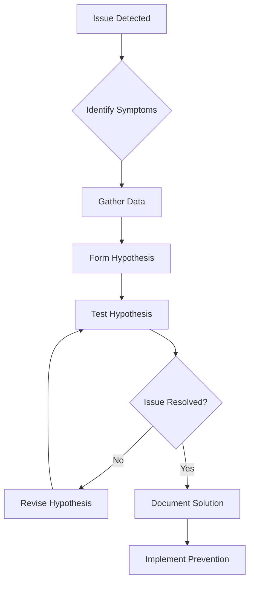

# Comprehensive Troubleshooting Guide: MEV Infrastructure
**Version**: 2.0  
**Last Updated**: July 11, 2025  
**Classification**: Operational Documentation  
**Standard**: Google SRE Troubleshooting Methodology

---

## 📋 Table of Contents

1. [Troubleshooting Framework](#troubleshooting-framework)
2. [Common Issues & Solutions](#common-issues--solutions)
3. [Performance Troubleshooting](#performance-troubleshooting)
4. [Network & Connectivity Issues](#network--connectivity-issues)
5. [MEV Engine Problems](#mev-engine-problems)
6. [Database & Storage Issues](#database--storage-issues)
7. [Security Incidents](#security-incidents)
8. [Advanced Diagnostics](#advanced-diagnostics)
9. [Recovery Procedures](#recovery-procedures)

---

## 🔍 Troubleshooting Framework

### Systematic Approach



### Initial Assessment Checklist

```bash
#!/bin/bash
# MEV Infrastructure Quick Diagnostic Script

echo "=== MEV System Diagnostic Report ==="
echo "Generated: $(date)"
echo "Operator: $USER"

# 1. Check system vitals
echo -e "\n[1] System Resources:"
df -h | grep -E "/$|/data"
free -h
uptime

# 2. Check service status
echo -e "\n[2] Service Status:"
for service in ethereum-erigon mev-detection mev-execution mev-analytics nginx redis postgresql; do
    status=$(systemctl is-active $service 2>/dev/null || echo "not-found")
    echo "  $service: $status"
done

# 3. Check recent errors
echo -e "\n[3] Recent Errors (last 10 minutes):"
journalctl --since "10 minutes ago" -p err --no-pager | tail -20

# 4. Network connectivity
echo -e "\n[4] Network Connectivity:"
for endpoint in ethereum:8545 base:8546 polygon:8547; do
    host=$(echo $endpoint | cut -d: -f1)
    port=$(echo $endpoint | cut -d: -f2)
    timeout 2 nc -zv localhost $port 2>&1 | grep -E "succeeded|refused|timed"
done

# 5. MEV engine health
echo -e "\n[5] MEV Engine Health:"
curl -s http://localhost:8090/health | jq -r '.status' 2>/dev/null || echo "API unreachable"

echo -e "\n=== End of Diagnostic Report ==="
```

---

## 🔧 Common Issues & Solutions

### Issue: High Memory Usage Leading to OOM Kills

**Symptoms:**
- Services randomly dying
- `dmesg` shows OOM killer messages
- System becoming unresponsive

**Diagnosis:**
```bash
# Check memory usage by process
ps aux --sort=-%mem | head -20

# Check OOM killer logs
dmesg | grep -i "killed process"

# Monitor memory in real-time
watch -n 1 'free -h; echo; ps aux --sort=-%mem | head -10'
```

**Solutions:**

1. **Immediate Relief:**
```bash
# Clear cache
sync && echo 3 > /proc/sys/vm/drop_caches

# Restart memory-hungry services
systemctl restart mev-detection
systemctl restart ethereum-erigon

# Enable swap if not present
fallocate -l 32G /swapfile
chmod 600 /swapfile
mkswap /swapfile
swapon /swapfile
```

2. **Long-term Fix:**
```bash
# Adjust service memory limits
cat >> /etc/systemd/system/mev-detection.service.d/override.conf << EOF
[Service]
MemoryLimit=16G
MemoryMax=16G
EOF

# Optimize Java heap sizes (if applicable)
export JAVA_OPTS="-Xmx8g -Xms4g -XX:+UseG1GC"

# Implement memory monitoring
cat > /usr/local/bin/memory-monitor.sh << 'EOF'
#!/bin/bash
while true; do
    mem_percent=$(free | grep Mem | awk '{print ($3/$2) * 100.0}')
    if (( $(echo "$mem_percent > 90" | bc -l) )); then
        echo "ALERT: Memory usage above 90% at $(date)" | tee -a /var/log/memory-alerts.log
        # Restart services or alert operators
    fi
    sleep 60
done
EOF
chmod +x /usr/local/bin/memory-monitor.sh
```

### Issue: MEV Opportunities Not Being Detected

**Symptoms:**
- Zero opportunities shown in dashboard
- Detection rate dropping suddenly
- Competitors capturing all opportunities

**Diagnosis:**
```bash
# Check detection service logs
journalctl -u mev-detection --since "1 hour ago" | grep -E "ERROR|WARN"

# Verify mempool access
curl -X POST http://localhost:8545 \
     -H "Content-Type: application/json" \
     -d '{"jsonrpc":"2.0","method":"eth_newPendingTransactionFilter","params":[],"id":1}'

# Check websocket connections
netstat -an | grep :8546 | grep ESTABLISHED

# Verify detection configuration
cat /etc/mev/detection-config.yaml | grep -E "enabled|threshold"
```

**Solutions:**

1. **Fix Mempool Access:**
```bash
# Restart with mempool flags
systemctl stop ethereum-erigon
/usr/local/bin/erigon \
    --txpool.globalslots=20000 \
    --txpool.globalbasefeeeslots=30000 \
    --txpool.accountslots=16 \
    --txpool.pricebump=10 \
    --ws \
    --ws.port=8546 \
    --http.api=eth,net,web3,txpool &

# Test mempool subscription
wscat -c ws://localhost:8546
> {"jsonrpc":"2.0","method":"eth_subscribe","params":["newPendingTransactions"],"id":1}
```

2. **Recalibrate Detection Parameters:**
```python
# Update detection thresholds
import yaml

config_path = '/etc/mev/detection-config.yaml'
with open(config_path, 'r') as f:
    config = yaml.safe_load(f)

# Lower thresholds temporarily
config['detection']['min_profit_wei'] = 10000000000000000  # 0.01 ETH
config['detection']['gas_price_multiplier'] = 1.1
config['detection']['enable_all_types'] = True

with open(config_path, 'w') as f:
    yaml.dump(config, f)

# Restart detection
os.system('systemctl restart mev-detection')
```

### Issue: Transaction Execution Failures

**Symptoms:**
- Transactions reverting on-chain
- "Transaction underpriced" errors
- Lost gas fees without profit

**Diagnosis:**
```bash
# Check recent transaction failures
mev-cli transactions list --status=failed --limit=10

# Analyze failure reasons
for tx in $(mev-cli transactions list --status=failed --format=json | jq -r '.[].hash'); do
    echo "Analyzing transaction: $tx"
    cast tx $tx --rpc-url http://localhost:8545
    cast run $tx --rpc-url http://localhost:8545
done

# Check gas price competitiveness
current_gas=$(cast gas-price --rpc-url http://localhost:8545)
echo "Current gas price: $current_gas"
```

**Solutions:**

1. **Optimize Gas Strategy:**
```javascript
// Dynamic gas price adjustment
const Web3 = require('web3');
const web3 = new Web3('http://localhost:8545');

async function getOptimalGasPrice() {
    const block = await web3.eth.getBlock('latest');
    const gasPrice = await web3.eth.getGasPrice();
    
    // Analyze recent blocks
    const recentBlocks = [];
    for (let i = 0; i < 10; i++) {
        const b = await web3.eth.getBlock(block.number - i);
        recentBlocks.push(b);
    }
    
    // Calculate competitive gas price
    const avgGasPrice = recentBlocks.reduce((sum, b) => {
        return sum + BigInt(b.baseFeePerGas || 0);
    }, 0n) / 10n;
    
    const competitivePrice = avgGasPrice * 115n / 100n; // 15% premium
    
    return {
        base: avgGasPrice.toString(),
        competitive: competitivePrice.toString(),
        aggressive: (competitivePrice * 130n / 100n).toString()
    };
}

// Update MEV configuration
async function updateGasConfig() {
    const prices = await getOptimalGasPrice();
    // Update configuration file or API
    console.log('Recommended gas prices:', prices);
}
```

2. **Implement Retry Logic:**
```python
import time
from web3 import Web3

class TransactionExecutor:
    def __init__(self, w3, max_retries=3):
        self.w3 = w3
        self.max_retries = max_retries
    
    def execute_with_retry(self, tx_params):
        for attempt in range(self.max_retries):
            try:
                # Increase gas price on each retry
                if attempt > 0:
                    tx_params['gasPrice'] = int(tx_params['gasPrice'] * 1.1)
                
                # Send transaction
                tx_hash = self.w3.eth.send_transaction(tx_params)
                receipt = self.w3.eth.wait_for_transaction_receipt(tx_hash)
                
                if receipt['status'] == 1:
                    return receipt
                else:
                    print(f"Transaction failed, attempt {attempt + 1}")
                    
            except Exception as e:
                print(f"Error on attempt {attempt + 1}: {e}")
                if attempt < self.max_retries - 1:
                    time.sleep(1)  # Brief pause before retry
                    
        raise Exception("Transaction failed after all retries")
```

---

## ⚡ Performance Troubleshooting

### Issue: High Latency in Opportunity Detection

**Symptoms:**
- Detection latency > 15ms
- Missing time-sensitive opportunities
- Dashboard showing delays

**Diagnosis:**
```bash
# Profile detection pipeline
mev-cli debug latency --breakdown

# Check CPU throttling
cat /proc/cpuinfo | grep MHz
cpupower frequency-info

# Analyze network latency
mtr -r -c 100 ethereum-node.internal

# Check disk I/O
iostat -x 1 10
```

**Solutions:**

1. **CPU Optimization:**
```bash
# Disable CPU frequency scaling
for cpu in /sys/devices/system/cpu/cpu*/cpufreq/scaling_governor; do
    echo performance > $cpu
done

# Pin critical processes to specific CPUs
taskset -c 0-3 $(pgrep mev-detection)
taskset -c 4-7 $(pgrep mev-execution)

# Disable hyper-threading for latency-critical cores
echo 0 > /sys/devices/system/cpu/cpu4/online
echo 0 > /sys/devices/system/cpu/cpu5/online
```

2. **Memory and Cache Optimization:**
```c
// Enable huge pages for critical data structures
#include <sys/mman.h>

void* allocate_huge_pages(size_t size) {
    void* ptr = mmap(NULL, size, 
                     PROT_READ | PROT_WRITE,
                     MAP_PRIVATE | MAP_ANONYMOUS | MAP_HUGETLB,
                     -1, 0);
    if (ptr == MAP_FAILED) {
        // Fallback to normal allocation
        ptr = malloc(size);
    }
    return ptr;
}

// Use for opportunity detection buffer
opportunity_buffer = allocate_huge_pages(BUFFER_SIZE);
```

### Issue: Database Query Performance Degradation

**Symptoms:**
- Slow dashboard loading
- API timeout errors
- High database CPU usage

**Diagnosis:**
```sql
-- Check slow queries
SELECT 
    query,
    calls,
    mean_exec_time,
    total_exec_time
FROM pg_stat_statements
WHERE mean_exec_time > 100
ORDER BY mean_exec_time DESC
LIMIT 10;

-- Check table bloat
SELECT
    schemaname,
    tablename,
    pg_size_pretty(pg_total_relation_size(schemaname||'.'||tablename)) AS size,
    n_dead_tup,
    n_live_tup,
    round(n_dead_tup::numeric / NULLIF(n_live_tup, 0), 4) AS dead_ratio
FROM pg_stat_user_tables
WHERE n_dead_tup > 1000
ORDER BY dead_ratio DESC;
```

**Solutions:**

1. **Query Optimization:**
```sql
-- Add missing indexes
CREATE INDEX CONCURRENTLY idx_opportunities_timestamp 
    ON mev_opportunities(detected_at) 
    WHERE status = 'active';

CREATE INDEX CONCURRENTLY idx_transactions_profit 
    ON mev_transactions(profit_amount) 
    WHERE status = 'confirmed';

-- Optimize common queries
-- Before: Full table scan
SELECT * FROM mev_opportunities 
WHERE detected_at > NOW() - INTERVAL '1 hour';

-- After: Index scan with partial results
SELECT id, chain, type, profit_estimate 
FROM mev_opportunities 
WHERE detected_at > NOW() - INTERVAL '1 hour'
    AND status = 'active'
ORDER BY detected_at DESC
LIMIT 100;
```

2. **Database Maintenance:**
```bash
#!/bin/bash
# Automated database maintenance script

# Run VACUUM on large tables
psql -U mev_user -d mev_db << EOF
VACUUM ANALYZE mev_opportunities;
VACUUM ANALYZE mev_transactions;
VACUUM ANALYZE mev_profits;
EOF

# Rebuild indexes if needed
psql -U mev_user -d mev_db << EOF
REINDEX TABLE CONCURRENTLY mev_opportunities;
REINDEX TABLE CONCURRENTLY mev_transactions;
EOF

# Update table statistics
psql -U mev_user -d mev_db << EOF
ANALYZE;
EOF
```

---

## 🌐 Network & Connectivity Issues

### Issue: Node Disconnections and Peer Loss

**Symptoms:**
- "No peers" warnings
- Block sync falling behind
- Intermittent connection errors

**Diagnosis:**
```bash
# Check peer count
for port in 8545 8546 8547 8548 8549; do
    echo -n "Port $port peers: "
    curl -s -X POST http://localhost:$port \
         -H "Content-Type: application/json" \
         -d '{"jsonrpc":"2.0","method":"net_peerCount","params":[],"id":1}' \
         | jq -r '.result' | xargs printf "%d\n"
done

# Check network interfaces
ip addr show
ip route show

# Test connectivity to bootstrap nodes
for node in boot.ethereum.org:30303 bootnode.polygon.network:30303; do
    nc -zv $node
done
```

**Solutions:**

1. **Network Configuration:**
```bash
# Increase connection limits
cat >> /etc/sysctl.conf << EOF
net.core.somaxconn = 65535
net.ipv4.tcp_max_syn_backlog = 65535
net.ipv4.ip_local_port_range = 1024 65535
net.ipv4.tcp_tw_reuse = 1
net.ipv4.tcp_fin_timeout = 15
EOF
sysctl -p

# Configure firewall for P2P
iptables -A INPUT -p tcp --dport 30303 -j ACCEPT
iptables -A INPUT -p udp --dport 30303 -j ACCEPT
iptables -A OUTPUT -p tcp --dport 30303 -j ACCEPT
iptables -A OUTPUT -p udp --dport 30303 -j ACCEPT
```

2. **Add Static Peers:**
```javascript
// ethereum static peers
const staticPeers = [
    "enode://pubkey1@ip1:30303",
    "enode://pubkey2@ip2:30303",
    "enode://pubkey3@ip3:30303"
];

// Add via RPC
const Web3 = require('web3');
const web3 = new Web3('http://localhost:8545');

staticPeers.forEach(async (peer) => {
    try {
        await web3.currentProvider.send({
            jsonrpc: '2.0',
            method: 'admin_addPeer',
            params: [peer],
            id: 1
        });
        console.log(`Added peer: ${peer}`);
    } catch (e) {
        console.error(`Failed to add peer: ${e}`);
    }
});
```

### Issue: RPC Endpoint Timeouts

**Symptoms:**
- "Request timeout" errors
- Slow API responses
- Connection pool exhaustion

**Diagnosis:**
```bash
# Check connection pool
netstat -an | grep :8545 | wc -l

# Monitor response times
while true; do
    start=$(date +%s%N)
    curl -s -X POST http://localhost:8545 \
         -H "Content-Type: application/json" \
         -d '{"jsonrpc":"2.0","method":"eth_blockNumber","params":[],"id":1}' > /dev/null
    end=$(date +%s%N)
    echo "Response time: $(( ($end - $start) / 1000000 ))ms"
    sleep 1
done
```

**Solutions:**

1. **Connection Pool Optimization:**
```nginx
# nginx.conf optimization
upstream ethereum_backend {
    server 127.0.0.1:8545 max_conns=100;
    server 127.0.0.1:8645 max_conns=100 backup;
    keepalive 32;
}

server {
    location /ethereum {
        proxy_pass http://ethereum_backend;
        proxy_http_version 1.1;
        proxy_set_header Connection "";
        
        # Timeouts
        proxy_connect_timeout 5s;
        proxy_send_timeout 10s;
        proxy_read_timeout 10s;
        
        # Buffering
        proxy_buffering off;
        proxy_request_buffering off;
    }
}
```

2. **Circuit Breaker Implementation:**
```python
import time
from functools import wraps

class CircuitBreaker:
    def __init__(self, failure_threshold=5, recovery_timeout=60):
        self.failure_threshold = failure_threshold
        self.recovery_timeout = recovery_timeout
        self.failure_count = 0
        self.last_failure_time = None
        self.state = 'CLOSED'  # CLOSED, OPEN, HALF_OPEN
    
    def call(self, func, *args, **kwargs):
        if self.state == 'OPEN':
            if time.time() - self.last_failure_time > self.recovery_timeout:
                self.state = 'HALF_OPEN'
            else:
                raise Exception("Circuit breaker is OPEN")
        
        try:
            result = func(*args, **kwargs)
            if self.state == 'HALF_OPEN':
                self.state = 'CLOSED'
                self.failure_count = 0
            return result
        except Exception as e:
            self.failure_count += 1
            self.last_failure_time = time.time()
            
            if self.failure_count >= self.failure_threshold:
                self.state = 'OPEN'
            
            raise e

# Usage
breaker = CircuitBreaker()

def make_rpc_call(method, params):
    return breaker.call(actual_rpc_call, method, params)
```

---

## 🤖 MEV Engine Problems

### Issue: Strategy Execution Errors

**Symptoms:**
- Strategies not triggering
- Incorrect profit calculations
- Execution reverts

**Diagnosis:**
```bash
# Check strategy configuration
cat /etc/mev/strategies/*.yaml | grep -E "enabled|threshold"

# Review strategy logs
journalctl -u mev-strategy-* --since "1 hour ago" | grep -E "ERROR|executing"

# Test strategy simulation
mev-cli strategy test --name arbitrage --simulate
```

**Solutions:**

1. **Strategy Debugging:**
```python
# Enhanced strategy debugging
import logging
from web3 import Web3

class StrategyDebugger:
    def __init__(self, strategy_name):
        self.strategy_name = strategy_name
        self.logger = self._setup_logger()
        
    def _setup_logger(self):
        logger = logging.getLogger(f'strategy.{self.strategy_name}')
        logger.setLevel(logging.DEBUG)
        
        # File handler with detailed formatting
        fh = logging.FileHandler(f'/var/log/mev/strategy_{self.strategy_name}_debug.log')
        fh.setLevel(logging.DEBUG)
        
        formatter = logging.Formatter(
            '%(asctime)s - %(name)s - %(levelname)s - %(message)s'
        )
        fh.setFormatter(formatter)
        logger.addHandler(fh)
        
        return logger
    
    def trace_execution(self, opportunity):
        self.logger.debug(f"Processing opportunity: {opportunity['id']}")
        self.logger.debug(f"Profit estimate: {opportunity['profit']}")
        self.logger.debug(f"Gas estimate: {opportunity['gas']}")
        
        # Add execution tracing
        try:
            result = self.execute_strategy(opportunity)
            self.logger.info(f"Execution successful: {result}")
        except Exception as e:
            self.logger.error(f"Execution failed: {str(e)}", exc_info=True)
            raise
```

2. **Fix Common Strategy Issues:**
```javascript
// Common fixes for arbitrage strategies

// 1. Slippage calculation fix
function calculateSlippageAdjustedAmount(amount, slippageBps = 50) {
    // Ensure BigNumber arithmetic
    const slippageFactor = BigNumber.from(10000 - slippageBps);
    const adjustedAmount = amount.mul(slippageFactor).div(10000);
    return adjustedAmount;
}

// 2. Gas price competition fix
async function getCompetitiveGasPrice(web3, percentile = 75) {
    const blockCount = 10;
    const blocks = [];
    
    const latest = await web3.eth.getBlockNumber();
    for (let i = 0; i < blockCount; i++) {
        blocks.push(await web3.eth.getBlock(latest - i, true));
    }
    
    // Extract gas prices from transactions
    const gasPrices = blocks.flatMap(block => 
        block.transactions.map(tx => BigInt(tx.gasPrice))
    ).sort((a, b) => a > b ? 1 : -1);
    
    const index = Math.floor(gasPrices.length * percentile / 100);
    return gasPrices[index].toString();
}

// 3. Deadline calculation fix
function getDeadline(seconds = 300) {
    return Math.floor(Date.now() / 1000) + seconds;
}
```

---

## 💾 Database & Storage Issues

### Issue: Disk Space Exhaustion

**Symptoms:**
- "No space left on device" errors
- Database crashes
- Services failing to start

**Diagnosis:**
```bash
# Check disk usage
df -h
du -sh /data/blockchain/* | sort -hr | head -20

# Find large files
find /data -type f -size +1G -exec ls -lh {} \;

# Check for runaway logs
ls -lhS /var/log/mev/
```

**Solutions:**

1. **Emergency Cleanup:**
```bash
#!/bin/bash
# Emergency disk cleanup script

echo "Starting emergency disk cleanup..."

# 1. Rotate and compress logs
logrotate -f /etc/logrotate.d/mev

# 2. Clean old blockchain data
find /data/blockchain/*/ancient -name "*.ldb" -mtime +30 -delete

# 3. Vacuum PostgreSQL
psql -U postgres -c "VACUUM FULL;"

# 4. Clear temporary files
rm -rf /tmp/mev_*
rm -rf /var/tmp/mev_*

# 5. Clean Docker if applicable
docker system prune -af

echo "Cleanup complete. New disk usage:"
df -h
```

2. **Implement Automated Cleanup:**
```python
import os
import time
import shutil
from pathlib import Path

class DiskSpaceManager:
    def __init__(self, threshold_percent=85):
        self.threshold_percent = threshold_percent
        self.cleanup_rules = [
            {
                'path': '/var/log/mev',
                'pattern': '*.log',
                'days_old': 7,
                'action': 'compress'
            },
            {
                'path': '/data/blockchain/ethereum/ancient',
                'pattern': '*.ldb',
                'days_old': 30,
                'action': 'delete'
            },
            {
                'path': '/tmp',
                'pattern': 'mev_*',
                'days_old': 1,
                'action': 'delete'
            }
        ]
    
    def check_disk_usage(self):
        stat = os.statvfs('/')
        total = stat.f_blocks * stat.f_frsize
        used = (stat.f_blocks - stat.f_avail) * stat.f_frsize
        percent = (used / total) * 100
        return percent
    
    def cleanup(self):
        for rule in self.cleanup_rules:
            self.apply_cleanup_rule(rule)
    
    def apply_cleanup_rule(self, rule):
        path = Path(rule['path'])
        cutoff_time = time.time() - (rule['days_old'] * 24 * 60 * 60)
        
        for file in path.glob(rule['pattern']):
            if file.stat().st_mtime < cutoff_time:
                if rule['action'] == 'delete':
                    file.unlink()
                elif rule['action'] == 'compress':
                    os.system(f"gzip {file}")

# Run periodically
manager = DiskSpaceManager()
if manager.check_disk_usage() > manager.threshold_percent:
    manager.cleanup()
```

---

## 🔒 Security Incidents

### Issue: Suspicious Activity Detected

**Symptoms:**
- Unexpected transactions
- Unusual API access patterns
- Configuration changes

**Diagnosis:**
```bash
# Check for unauthorized access
grep "Failed password" /var/log/auth.log | tail -50
last -50

# Review API access logs
grep -E "401|403" /var/log/nginx/access.log | tail -100

# Check for configuration changes
find /etc/mev -type f -mtime -1 -ls

# Monitor active connections
netstat -tulpn | grep ESTABLISHED
```

**Solutions:**

1. **Immediate Response:**
```bash
#!/bin/bash
# Security incident response script

echo "SECURITY INCIDENT RESPONSE INITIATED"

# 1. Isolate the system
iptables -I INPUT 1 -j DROP
iptables -I OUTPUT 1 -j DROP
# Allow only management access
iptables -I INPUT 1 -s 10.0.0.0/8 -j ACCEPT

# 2. Capture evidence
mkdir -p /security/incident-$(date +%Y%m%d-%H%M%S)
cd /security/incident-*

# System state
ps auxf > processes.txt
netstat -tulpan > connections.txt
lastlog > login_history.txt

# Logs
cp -r /var/log/mev/ ./logs/
cp /var/log/auth.log ./
cp /var/log/nginx/ ./nginx-logs/

# 3. Check wallet integrity
mev-cli wallet check --security-audit > wallet_audit.txt

# 4. Notify security team
echo "Security incident detected at $(date)" | \
    mail -s "URGENT: MEV Security Incident" security@company.com
```

2. **Post-Incident Hardening:**
```python
# Enhanced security monitoring
import hashlib
import json
from datetime import datetime

class SecurityMonitor:
    def __init__(self):
        self.baseline = self.create_baseline()
    
    def create_baseline(self):
        """Create security baseline"""
        baseline = {
            'configs': {},
            'binaries': {},
            'permissions': {}
        }
        
        # Hash critical files
        critical_files = [
            '/etc/mev/config.yaml',
            '/usr/local/bin/mev-engine',
            '/etc/mev/wallets.json'
        ]
        
        for file in critical_files:
            with open(file, 'rb') as f:
                baseline['configs'][file] = hashlib.sha256(f.read()).hexdigest()
        
        return baseline
    
    def check_integrity(self):
        """Check system integrity against baseline"""
        violations = []
        
        for file, expected_hash in self.baseline['configs'].items():
            with open(file, 'rb') as f:
                current_hash = hashlib.sha256(f.read()).hexdigest()
            
            if current_hash != expected_hash:
                violations.append({
                    'file': file,
                    'expected': expected_hash,
                    'current': current_hash,
                    'timestamp': datetime.now().isoformat()
                })
        
        if violations:
            self.alert_security_team(violations)
        
        return violations
```

---

## 🔬 Advanced Diagnostics

### Performance Profiling

```bash
#!/bin/bash
# Advanced performance profiling

# 1. CPU profiling with perf
perf record -g -p $(pgrep mev-detection) -- sleep 30
perf report --stdio > cpu_profile.txt

# 2. Memory profiling
valgrind --leak-check=full --track-origins=yes \
    /usr/local/bin/mev-detection 2> memory_profile.txt

# 3. Network profiling with tcpdump
tcpdump -i any -w network_capture.pcap \
    'port 8545 or port 8546' -c 10000

# 4. System call tracing
strace -c -p $(pgrep mev-execution) -f -o syscall_trace.txt
```

### MEV Engine Deep Dive

```python
# Deep diagnostic tool for MEV engine
import asyncio
import aiohttp
import time
from collections import defaultdict

class MEVEngineDiagnostics:
    def __init__(self, base_url='http://localhost:8090'):
        self.base_url = base_url
        self.metrics = defaultdict(list)
    
    async def run_diagnostics(self):
        """Run comprehensive diagnostics"""
        tests = [
            self.test_detection_pipeline,
            self.test_calculation_accuracy,
            self.test_execution_path,
            self.test_websocket_stability,
            self.test_database_queries
        ]
        
        results = {}
        for test in tests:
            test_name = test.__name__
            try:
                result = await test()
                results[test_name] = {
                    'status': 'passed',
                    'details': result
                }
            except Exception as e:
                results[test_name] = {
                    'status': 'failed',
                    'error': str(e)
                }
        
        return results
    
    async def test_detection_pipeline(self):
        """Test opportunity detection pipeline"""
        async with aiohttp.ClientSession() as session:
            # Measure detection latency
            latencies = []
            for _ in range(100):
                start = time.time()
                async with session.get(f'{self.base_url}/api/v2/opportunities') as resp:
                    await resp.json()
                latencies.append((time.time() - start) * 1000)
            
            return {
                'avg_latency_ms': sum(latencies) / len(latencies),
                'p99_latency_ms': sorted(latencies)[int(len(latencies) * 0.99)],
                'min_latency_ms': min(latencies),
                'max_latency_ms': max(latencies)
            }

# Run diagnostics
async def main():
    diag = MEVEngineDiagnostics()
    results = await diag.run_diagnostics()
    print(json.dumps(results, indent=2))

asyncio.run(main())
```

---

## 🔄 Recovery Procedures

### Complete System Recovery

```bash
#!/bin/bash
# Master recovery script

echo "=== MEV Infrastructure Recovery Procedure ==="
echo "This will restore the system from backup"
echo "Press Ctrl+C to cancel, Enter to continue"
read

# 1. Stop all services
echo "[1/6] Stopping all services..."
systemctl stop mev-* nginx postgresql redis

# 2. Backup current state
echo "[2/6] Backing up current state..."
tar -czf /backup/pre-recovery-$(date +%s).tar.gz \
    /etc/mev /var/log/mev /data/mev

# 3. Restore from backup
echo "[3/6] Restoring from backup..."
LATEST_BACKUP=$(ls -t /backup/mev-full-* | head -1)
tar -xzf $LATEST_BACKUP -C /

# 4. Restore database
echo "[4/6] Restoring database..."
pg_restore -U postgres -d mev_db /backup/mev_db_latest.dump

# 5. Verify configuration
echo "[5/6] Verifying configuration..."
mev-cli config validate
mev-cli wallet verify

# 6. Start services
echo "[6/6] Starting services..."
systemctl start postgresql redis nginx
sleep 10
systemctl start mev-detection mev-execution mev-analytics

echo "Recovery complete!"
mev-cli health check --full
```

### Partial Recovery Procedures

```python
# Selective recovery tool
import subprocess
import json
from datetime import datetime

class SelectiveRecovery:
    def __init__(self):
        self.recovery_points = self.list_recovery_points()
    
    def list_recovery_points(self):
        """List available recovery points"""
        cmd = "ls -la /backup/mev-* | grep -E 'checkpoint|snapshot'"
        result = subprocess.run(cmd, shell=True, capture_output=True, text=True)
        return result.stdout.strip().split('\n')
    
    def recover_component(self, component, timestamp):
        """Recover specific component"""
        recovery_map = {
            'config': self.recover_config,
            'wallets': self.recover_wallets,
            'strategies': self.recover_strategies,
            'database': self.recover_database
        }
        
        if component in recovery_map:
            return recovery_map[component](timestamp)
        else:
            raise ValueError(f"Unknown component: {component}")
    
    def recover_config(self, timestamp):
        """Recover configuration files"""
        backup_path = f"/backup/mev-config-{timestamp}.tar.gz"
        subprocess.run([
            "tar", "-xzf", backup_path, 
            "-C", "/", 
            "etc/mev/"
        ])
        
        # Restart affected services
        subprocess.run(["systemctl", "restart", "mev-detection"])
        return "Configuration recovered successfully"
```

---

## 📞 Emergency Contacts

### Escalation Chain

| Level | Role | Contact | Availability |
|-------|------|---------|--------------|
| L1 | On-Call Engineer | ops-oncall@company.com | 24/7 |
| L2 | Team Lead | mev-team-lead@company.com | 24/7 |
| L3 | Director of Engineering | director-eng@company.com | Business hours |
| L4 | VP of Engineering | vp-eng@company.com | Emergency only |

### External Support

| Service | Contact | Use Case |
|---------|---------|----------|
| AWS Support | 1-800-xxx-xxxx | Infrastructure issues |
| Cloudflare | support@cloudflare.com | DDoS attacks |
| Chain Support | Various | Node sync issues |

---

*This troubleshooting guide provides comprehensive procedures for diagnosing and resolving issues in the MEV infrastructure. Regular training and simulations should be conducted to ensure team readiness.*