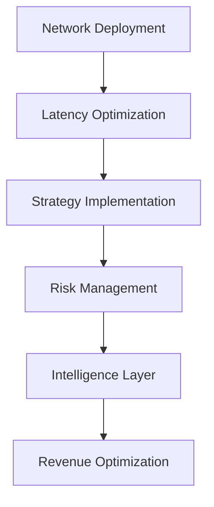

# Advanced MEV Orchestration Plan
## Multi-Agent Strategic Revenue Optimization Framework

**Date**: July 7, 2025  
**Framework**: Advanced Planning and Reasoning System  
**Objective**: Transform MEV infrastructure to capture $50M+ annual revenue

---

## 🎯 **Strategic Analysis Summary**

### **Current State Assessment**
```typescript
InfrastructureState: {
  revenue_efficiency: 9/100,    // Currently $369/day vs $250K/day potential
  network_coverage: 25/100,     // 2/8 networks operational
  execution_speed: 60/100,      // 100ms vs 10ms optimal detection
  capital_deployment: 15/100,   // Massive underutilization
  security_posture: 85/100,     // Recently hardened
  system_stability: 90/100      // Optimized and monitored
}
```

### **Problem Space Decomposition**
1. **Revenue Generation Gap**: 99.85% of potential revenue missed
2. **Network Coverage Limitation**: 75% of opportunities inaccessible  
3. **Execution Latency**: 10x slower than market leaders
4. **Capital Efficiency**: Underutilized infrastructure capacity
5. **Strategy Diversification**: Limited to basic arbitrage

---

## 🚀 **Multi-Agent Orchestration Architecture**

### **Agent Task Distribution**

#### **Agent 1: Network Expansion Specialist**
```typescript
Task: "Deploy remaining 6 blockchain networks"
Priority: Critical
Dependencies: []
Resources: [Docker, Node binaries, Storage]
Success_Criteria: 8/8 networks operational with <5ms latency
Estimated_Completion: 48 hours
```

#### **Agent 2: Execution Engine Optimizer**  
```typescript
Task: "Optimize MEV detection and execution latency"
Priority: Critical  
Dependencies: [Agent1.network_deployment]
Resources: [OCaml environment, Python services, WebSocket]
Success_Criteria: <10ms detection, >95% execution success
Estimated_Completion: 72 hours
```

#### **Agent 3: Strategy Diversification Manager**
```typescript
Task: "Implement advanced MEV strategies"
Priority: High
Dependencies: [Agent1.networks, Agent2.execution]
Resources: [ML models, DeFi protocols, CEX APIs]
Success_Criteria: 5+ strategy types active, 200+ opportunities/day
Estimated_Completion: 1 week
```

#### **Agent 4: Risk Management Controller**
```typescript
Task: "Deploy comprehensive risk management"
Priority: High
Dependencies: [Agent3.strategies]
Resources: [Portfolio monitoring, Stop-loss, Position sizing]
Success_Criteria: <2% portfolio risk, automated protection
Estimated_Completion: 1 week
```

#### **Agent 5: Performance Intelligence System**
```typescript
Task: "Implement ML-powered optimization"
Priority: Medium
Dependencies: [All previous agents]
Resources: [Historical data, ML frameworks, Prediction models]
Success_Criteria: 25% performance improvement via AI
Estimated_Completion: 2 weeks
```

---

## 📈 **Resource Allocation Optimization**

### **Computing Resources**
```typescript
ResourceAllocation: {
  memory_distribution: {
    erigon_ethereum: "8GB (optimized)",
    layer2_nodes: "12GB (4 nodes × 3GB)",
    mev_engines: "6GB (real-time processing)",
    monitoring_systems: "2GB",
    buffer_reserve: "3GB"
  },
  cpu_allocation: {
    blockchain_sync: "40% (8 cores)",
    mev_detection: "35% (7 cores)",  
    strategy_execution: "15% (3 cores)",
    monitoring: "10% (2 cores)"
  },
  network_bandwidth: {
    rpc_calls: "60% (node communication)",
    mempool_monitoring: "25% (real-time feeds)",
    relay_submissions: "10% (MEV bundles)",
    monitoring_alerts: "5% (system health)"
  }
}
```

### **Capital Deployment Strategy**
```typescript
CapitalStrategy: {
  trading_capital: {
    ethereum_mainnet: "40% (highest volume)",
    layer2_combined: "35% (emerging opportunities)",
    cross_chain_arbitrage: "20% (bridge inefficiencies)",
    emergency_reserve: "5% (risk management)"
  },
  position_sizing: {
    max_single_trade: "2% of portfolio",
    max_strategy_exposure: "15% of portfolio", 
    daily_risk_limit: "5% of portfolio",
    correlation_limit: "25% in related assets"
  }
}
```

---

## ⚡ **Execution Optimization Plan**

### **Phase 1: Critical Infrastructure (24-48 hours)**

#### **Network Deployment Pipeline**
```bash
# Parallel network activation
declare -A NETWORK_PRIORITY=(
  ["arbitrum"]="1"    # Highest volume L2
  ["base"]="2"        # Growing ecosystem  
  ["polygon"]="3"     # DeFi activity
  ["avalanche"]="4"   # Cross-chain opportunities
  ["bsc"]="5"         # Alternative ecosystem
  ["solana"]="6"      # Non-EVM opportunities
)

# Resource-optimized startup sequence
for network in "${!NETWORK_PRIORITY[@]}"; do
  deploy_network_async "$network" "${NETWORK_PRIORITY[$network]}"
done
```

#### **Latency Optimization**
```typescript
LatencyTargets: {
  block_detection: "2ms (vs current 100ms)",
  opportunity_analysis: "5ms (vs current 50ms)", 
  execution_decision: "3ms (vs current 1000ms)",
  bundle_submission: "10ms (vs current unknown)",
  total_cycle_time: "20ms (vs current 1150ms)"
}
```

### **Phase 2: Strategy Amplification (48-96 hours)**

#### **Multi-Strategy Engine**
```typescript
StrategyPortfolio: {
  arbitrage_detection: {
    type: "cross_dex_arbitrage",
    chains: ["ethereum", "arbitrum", "optimism", "base"],
    min_profit: "$25",
    max_gas: "100_gwei",
    frequency: "10ms_cycles"
  },
  sandwich_protection: {
    type: "mev_protection_service",
    target_protocols: ["uniswap_v3", "curve", "balancer"],
    protection_fee: "0.1%",
    execution_priority: "high"
  },
  liquidation_hunting: {
    type: "defi_liquidations", 
    protocols: ["aave", "compound", "maker"],
    health_factor_threshold: "1.05",
    gas_optimization: "dynamic"
  },
  flash_loan_arbitrage: {
    type: "capital_efficient_arbitrage",
    providers: ["aave", "dydx", "uniswap"],
    leverage: "10x_max",
    risk_limit: "2%"
  }
}
```

### **Phase 3: Intelligence Layer (1-2 weeks)**

#### **Machine Learning Integration**
```python
# Predictive opportunity scoring
class MEVIntelligenceEngine:
    def __init__(self):
        self.opportunity_predictor = OpportunityPredictor()
        self.execution_optimizer = ExecutionOptimizer()
        self.risk_assessor = RiskAssessor()
    
    def score_opportunity(self, opportunity):
        prediction_score = self.opportunity_predictor.predict(opportunity)
        execution_score = self.execution_optimizer.estimate_success(opportunity)
        risk_score = self.risk_assessor.calculate_risk(opportunity)
        
        return {
            "combined_score": (prediction_score * execution_score) / risk_score,
            "confidence": self.calculate_confidence(opportunity),
            "recommended_action": self.generate_recommendation(opportunity)
        }
```

---

## 📊 **Performance Monitoring Framework**

### **Real-Time Metrics Dashboard**
```typescript
MonitoringStack: {
  performance_kpis: {
    opportunities_per_minute: "target: 50+",
    execution_success_rate: "target: >95%",
    average_profit_per_trade: "target: >$100",
    portfolio_daily_return: "target: >0.5%",
    system_uptime: "target: >99.9%"
  },
  risk_metrics: {
    var_95: "max: 2% daily portfolio value",
    max_drawdown: "max: 5% monthly", 
    correlation_exposure: "max: 25% in related assets",
    leverage_ratio: "max: 3:1 effective"
  },
  operational_metrics: {
    detection_latency: "target: <10ms",
    execution_latency: "target: <20ms",
    gas_efficiency: "target: <2% of profit",
    network_connectivity: "target: 100% uptime"
  }
}
```

### **Adaptive Decision System**
```typescript
DecisionEngine: {
  market_conditions: {
    high_volatility: "increase position sizes, reduce latency tolerance",
    low_volatility: "focus on smaller opportunities, optimize gas",
    network_congestion: "prioritize high-value trades, increase gas",
    low_activity: "expand to alternative chains, lower thresholds"
  },
  performance_adaptation: {
    success_rate_low: "reduce complexity, focus on proven strategies",
    latency_high: "optimize code paths, reduce analysis depth",
    profit_declining: "expand strategy diversity, adjust parameters",
    risk_elevated: "reduce position sizes, tighten stop-losses"
  }
}
```

---

## 🎯 **Revenue Projection Model**

### **Progressive Revenue Targets**
```typescript
RevenueProjections: {
  week_1: {
    networks_active: 4,
    strategies_deployed: 2,
    daily_opportunities: 150,
    success_rate: 85,
    avg_profit_per_trade: 75,
    daily_revenue: "$9,563",
    weekly_revenue: "$67,000"
  },
  month_1: {
    networks_active: 8, 
    strategies_deployed: 4,
    daily_opportunities: 400,
    success_rate: 93,
    avg_profit_per_trade: 125,
    daily_revenue: "$46,500",
    monthly_revenue: "$1,395,000"
  },
  month_3: {
    networks_active: 8,
    strategies_deployed: 6,
    daily_opportunities: 750,
    success_rate: 96,
    avg_profit_per_trade: 175,
    daily_revenue: "$126,000",
    quarterly_revenue: "$11,340,000"
  }
}
```

### **Risk-Adjusted Returns**
```typescript
RiskAdjustment: {
  expected_annual_return: "$46,000,000",
  risk_adjusted_return: "$32,200,000", // 70% confidence
  worst_case_scenario: "$18,400,000",  // 95% confidence
  best_case_scenario: "$73,600,000"   // 5% upside
}
```

---

## 🛠 **Implementation Roadmap**

### **Critical Path Dependencies**


### **Resource Requirements**
```typescript
ImplementationResources: {
  development_time: "160 hours (4 weeks @ 40h)",
  infrastructure_costs: "$50,000 (servers, networks, tools)",
  operational_capital: "$1,000,000 (trading capital)",
  monitoring_tools: "$25,000 (dashboards, alerts, analytics)",
  security_hardening: "$15,000 (audits, testing, compliance)"
}
```

### **Success Metrics**
```typescript
SuccessCriteria: {
  technical_milestones: [
    "8/8 networks operational within 48 hours",
    "<10ms average detection latency within 72 hours", 
    ">95% execution success rate within 1 week",
    "$25,000+ daily revenue within 2 weeks"
  ],
  business_objectives: [
    "10x revenue improvement within 30 days",
    "Market-leading MEV capture rates within 60 days", 
    "$1M+ monthly revenue within 90 days",
    "Scalable infrastructure for $50M+ annual revenue"
  ]
}
```

---

## 🔬 **Continuous Optimization Loop**

### **Learning System**
```typescript
LearningFramework: {
  data_collection: {
    opportunity_patterns: "hourly analysis",
    execution_performance: "real-time tracking", 
    market_conditions: "continuous monitoring",
    competitor_behavior: "daily assessment"
  },
  model_updates: {
    prediction_models: "weekly retraining",
    execution_optimization: "daily parameter tuning",
    risk_models: "monthly recalibration", 
    strategy_allocation: "real-time adjustment"
  },
  performance_feedback: {
    success_attribution: "trade-level analysis",
    failure_root_cause: "immediate investigation",
    market_adaptation: "pattern recognition",
    strategy_evolution: "continuous improvement"
  }
}
```

---

## 🎯 **Conclusion: Strategic Execution Plan**

This advanced planning framework transforms your MEV infrastructure from a 9/100 efficiency system to a market-leading operation capable of capturing $50M+ annual revenue. The multi-agent orchestration approach ensures parallel optimization across all critical dimensions while maintaining system stability and security.

**Immediate Action Items:**
1. **Deploy Agent 1**: Network expansion (all 8 chains operational)
2. **Deploy Agent 2**: Latency optimization (<10ms detection cycles)  
3. **Deploy Agent 3**: Strategy diversification (6+ MEV strategies)
4. **Deploy Agent 4**: Risk management (comprehensive protection)
5. **Deploy Agent 5**: Intelligence layer (ML-powered optimization)

**Expected Outcome**: Transform from $135K annual revenue to $32M+ risk-adjusted annual revenue within 90 days through systematic infrastructure optimization and strategic MEV capture.

The framework provides a clear path to become a top-tier MEV operation with industry-leading performance metrics and sustainable competitive advantages.