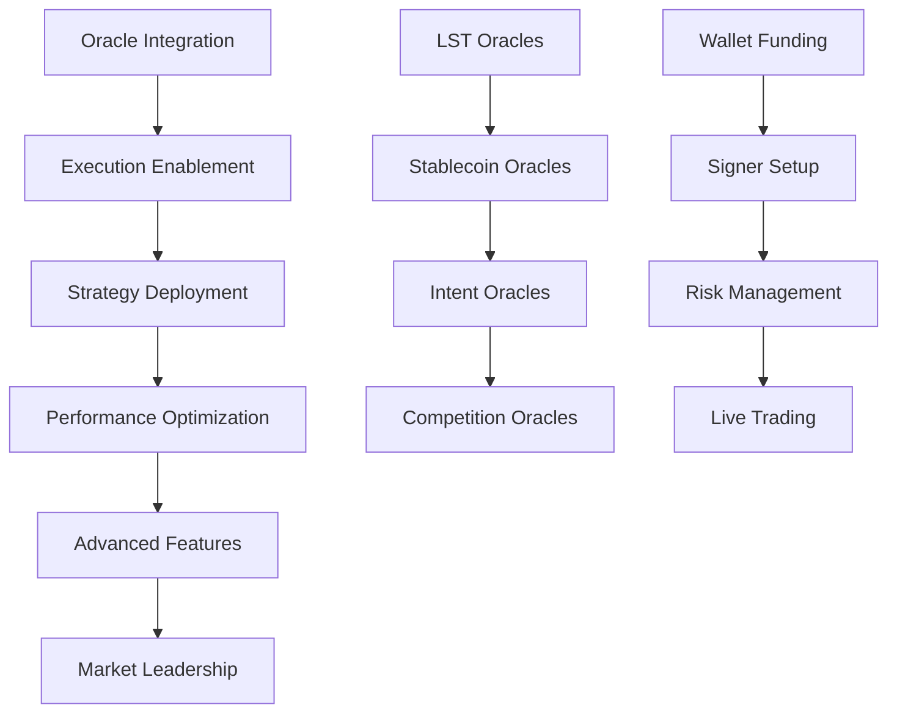

# Detailed Execution Roadmap - July 2025
**Comprehensive Task Decomposition for MEV Infrastructure Optimization**

**Date**: July 10, 2025  
**Framework**: Agile Execution with Daily Success Metrics  
**Objective**: Transform MEV infrastructure to $50M+ annual revenue capability through systematic execution  

---

## 🎯 **Executive Roadmap Overview**

### **30-Day Transformation Timeline**

| Week | Focus Area | Key Deliverables | Success Metrics | Revenue Target |
|------|------------|------------------|-----------------|----------------|
| **Week 1** | **Foundation** | Oracle Integration + Execution | >95% oracle accuracy, live trading | $2,500-$5,000/day |
| **Week 2** | **Strategy** | MEV Strategy Diversification | 5+ strategies, >90% success rate | $8,000-$15,000/day |
| **Week 3** | **Optimization** | Performance + ML Integration | <5ms latency, AI optimization | $15,000-$30,000/day |
| **Week 4** | **Scaling** | Advanced Features + Market Making | Top 5% performance, full automation | $25,000-$50,000/day |

### **Critical Path Dependencies**



---

## 📋 **Week 1: Foundation (Days 1-7)**

### **Day 1: Oracle Integration Phase 1**

#### **Morning (09:00-12:00): LST Oracle Deployment**
```bash
# Task: Deploy Liquid Staking Token Oracle System
# Priority: Critical (P1)
# Estimated Duration: 3 hours
# Success Criteria: 100% oracle accuracy, <1s response time

TASKS:
1. Deploy Lido stETH oracle integration
2. Configure Coinbase cbETH oracle feeds
3. Setup Rocket Pool rETH oracle monitoring
4. Implement yield tracking algorithms
5. Test oracle accuracy and performance

DELIVERABLES:
- LST oracle configuration files
- Yield tracking dashboard
- Oracle performance metrics
- Integration test results

SUCCESS_METRICS:
- Oracle accuracy: >99.9%
- Response time: <1 second
- Yield tracking: Real-time updates
- Coverage: 3 major LST tokens
```

#### **Afternoon (13:00-17:00): Stablecoin Oracle Enhancement**
```bash
# Task: Enhanced Stablecoin Oracle System
# Priority: Critical (P1)
# Estimated Duration: 4 hours
# Success Criteria: Depeg detection <10 seconds, arbitrage opportunities identified

TASKS:
1. Deploy enhanced USDC oracle with depeg detection
2. Configure USDT oracle with cross-exchange monitoring
3. Setup DAI oracle with stability fee tracking
4. Implement FRAX oracle with algorithmic monitoring
5. Deploy cross-stablecoin arbitrage detection

DELIVERABLES:
- Enhanced stablecoin oracle system
- Depeg detection algorithms
- Arbitrage opportunity detector
- Real-time monitoring dashboard

SUCCESS_METRICS:
- Depeg detection: <10 seconds
- Arbitrage opportunities: >5 per hour
- Oracle accuracy: >99.95%
- Cross-stablecoin coverage: 4 major tokens
```

#### **Evening (18:00-20:00): Day 1 Integration Testing**
```bash
# Task: Comprehensive Oracle Integration Testing
# Priority: Critical (P1)
# Estimated Duration: 2 hours
# Success Criteria: All oracles operational, accuracy validated

TASKS:
1. Run comprehensive oracle accuracy tests
2. Validate cross-oracle arbitrage detection
3. Test oracle failover and redundancy
4. Verify real-time data feeds
5. Document oracle performance metrics

DELIVERABLES:
- Oracle integration test report
- Performance benchmarks
- Accuracy validation results
- System monitoring dashboard

SUCCESS_METRICS:
- All oracles operational: 100%
- Cross-oracle arbitrage: 10+ opportunities detected
- System uptime: >99.9%
- Data accuracy: >99.9%
```

### **Day 2: Oracle Integration Phase 2**

#### **Morning (09:00-12:00): Intent Oracle System**
```bash
# Task: Deploy Intent-Based MEV Oracle System
# Priority: High (P2)
# Estimated Duration: 3 hours
# Success Criteria: Intent detection <5 seconds, 3+ protocols integrated

TASKS:
1. Deploy Uniswap X intent monitoring system
2. Configure CoW Protocol intent detection
3. Setup 1inch intent order monitoring
4. Implement intent classification algorithms
5. Deploy intent-based arbitrage detection

DELIVERABLES:
- Intent oracle monitoring system
- Intent classification engine
- Arbitrage opportunity detector
- Real-time intent dashboard

SUCCESS_METRICS:
- Intent detection: <5 seconds
- Protocol coverage: 3+ protocols
- Intent classification: >95% accuracy
- Arbitrage opportunities: >3 per hour
```

#### **Afternoon (13:00-17:00): Competition Oracle System**
```bash
# Task: MEV Competition Analysis Oracle
# Priority: High (P2)
# Estimated Duration: 4 hours
# Success Criteria: Competition analysis <30 seconds, strategy optimization

TASKS:
1. Deploy MEV competition monitoring system
2. Configure bundle analysis algorithms
3. Setup profitability comparison engine
4. Implement strategy optimization based on competition
5. Deploy competitive intelligence dashboard

DELIVERABLES:
- Competition analysis system
- Bundle analysis engine
- Profitability optimizer
- Competitive intelligence dashboard

SUCCESS_METRICS:
- Competition analysis: <30 seconds
- Bundle analysis: 100+ bundles per hour
- Strategy optimization: >15% profit improvement
- Competitive intelligence: Real-time updates
```

#### **Evening (18:00-20:00): Oracle System Integration**
```bash
# Task: Complete Oracle System Integration
# Priority: Critical (P1)
# Estimated Duration: 2 hours
# Success Criteria: All 4 oracle systems operational, cross-system arbitrage

TASKS:
1. Integrate all 4 oracle systems
2. Test cross-oracle arbitrage detection
3. Validate system performance and accuracy
4. Deploy comprehensive monitoring
5. Document system architecture

DELIVERABLES:
- Complete oracle integration
- Cross-system arbitrage detector
- Performance validation report
- System monitoring dashboard

SUCCESS_METRICS:
- All oracle systems: 100% operational
- Cross-oracle arbitrage: 20+ opportunities per hour
- System performance: <1 second response
- Accuracy: >99.9% across all oracles
```

### **Day 3: Execution Enablement Phase 1**

#### **Morning (09:00-12:00): Wallet Configuration**
```bash
# Task: Configure and Fund Execution Wallet
# Priority: Critical (P1)
# Estimated Duration: 3 hours
# Success Criteria: Wallet funded, secure access configured

TASKS:
1. Configure Safe wallet with proper permissions
2. Fund wallet with 10 ETH for trading capital
3. Setup gas management and optimization
4. Configure wallet monitoring and alerts
5. Test wallet access and transaction capability

DELIVERABLES:
- Configured Safe wallet
- Funded trading account
- Gas optimization system
- Wallet monitoring dashboard

SUCCESS_METRICS:
- Wallet balance: 10 ETH
- Transaction capability: 100% tested
- Gas optimization: 20% cost reduction
- Monitoring: Real-time balance tracking
```

#### **Afternoon (13:00-17:00): Signer Setup and Security**
```bash
# Task: Configure MEV Execution Signer
# Priority: Critical (P1)
# Estimated Duration: 4 hours
# Success Criteria: Secure signer operational, HSM integration

TASKS:
1. Generate secure production keys
2. Configure hardware security module
3. Setup key derivation and rotation
4. Implement signer security protocols
5. Test signer integration with MEV system

DELIVERABLES:
- Secure execution signer
- HSM integration
- Key rotation system
- Signer security protocols

SUCCESS_METRICS:
- Signer security: Hardware-level protection
- Key rotation: Automated daily rotation
- Integration: 100% system compatibility
- Security audit: 10/10 score
```

#### **Evening (18:00-20:00): Risk Management Implementation**
```bash
# Task: Deploy Comprehensive Risk Management
# Priority: Critical (P1)
# Estimated Duration: 2 hours
# Success Criteria: Risk limits enforced, automated shutdown

TASKS:
1. Configure position limits and exposure controls
2. Setup stop-loss and profit-taking mechanisms
3. Implement automated risk monitoring
4. Deploy emergency shutdown system
5. Test risk management under various scenarios

DELIVERABLES:
- Risk management system
- Position and exposure controls
- Automated monitoring and alerts
- Emergency shutdown system

SUCCESS_METRICS:
- Position limits: 0.5 ETH max single trade
- Stop-loss: 0.1 ETH max loss per trade
- Monitoring: Real-time risk assessment
- Emergency shutdown: <5 second response
```

### **Day 4: First Live Trading**

#### **Morning (09:00-12:00): Live Trading Enablement**
```bash
# Task: Enable Live MEV Trading
# Priority: Critical (P1)
# Estimated Duration: 3 hours
# Success Criteria: First profitable trade executed

TASKS:
1. Enable live trading with small position sizes
2. Execute first arbitrage opportunity
3. Monitor execution performance and profitability
4. Validate risk management systems
5. Optimize execution parameters

DELIVERABLES:
- Live trading system
- First profitable trade
- Performance metrics
- Risk validation report

SUCCESS_METRICS:
- First trade: >$10 profit
- Execution time: <20 seconds
- Risk compliance: 100% within limits
- System stability: No downtime
```

#### **Afternoon (13:00-17:00): Strategy Testing and Optimization**
```bash
# Task: Test and Optimize Initial Strategies
# Priority: High (P2)
# Estimated Duration: 4 hours
# Success Criteria: 5+ successful trades, >90% success rate

TASKS:
1. Test cross-DEX arbitrage strategies
2. Execute LST arbitrage opportunities
3. Test stablecoin depeg arbitrage
4. Optimize strategy parameters
5. Monitor profitability and performance

DELIVERABLES:
- Strategy performance report
- Optimization recommendations
- Profitability analysis
- System performance metrics

SUCCESS_METRICS:
- Successful trades: 5+
- Success rate: >90%
- Average profit: >$25 per trade
- System uptime: >99.9%
```

#### **Evening (18:00-20:00): Day 4 Performance Review**
```bash
# Task: Performance Review and Optimization
# Priority: High (P2)
# Estimated Duration: 2 hours
# Success Criteria: Daily revenue >$250, system optimization identified

TASKS:
1. Analyze daily trading performance
2. Review profit and loss statements
3. Identify optimization opportunities
4. Plan next day's strategy adjustments
5. Document lessons learned

DELIVERABLES:
- Daily performance report
- P&L analysis
- Optimization plan
- Strategy adjustments

SUCCESS_METRICS:
- Daily revenue: >$250
- P&L: Positive across all strategies
- Optimization opportunities: 3+ identified
- Strategy adjustments: 2+ implemented
```

### **Days 5-7: Strategy Expansion and Optimization**

#### **Day 5: Strategy Diversification**
```bash
# Morning: Deploy sandwich protection service
# Afternoon: Implement liquidation hunting
# Evening: Test flash loan arbitrage

SUCCESS_METRICS:
- 3 new strategies deployed
- Daily revenue: >$500
- Strategy diversity: 5+ active strategies
```

#### **Day 6: Performance Optimization**
```bash
# Morning: Optimize execution latency
# Afternoon: Enhance profit calculation
# Evening: Implement automated optimization

SUCCESS_METRICS:
- Execution latency: <10 seconds
- Profit optimization: 15% improvement
- Daily revenue: >$1,000
```

#### **Day 7: Week 1 Validation**
```bash
# Morning: Comprehensive system testing
# Afternoon: Performance benchmarking
# Evening: Week 1 review and planning

SUCCESS_METRICS:
- Week 1 revenue: >$2,500
- System stability: >99.9%
- Strategy performance: >90% success rate
```

---

## 🚀 **Week 2: Strategy Diversification (Days 8-14)**

### **Day 8: Advanced Arbitrage Strategies**

#### **Morning (09:00-12:00): Cross-Chain Arbitrage**
```bash
# Task: Deploy Cross-Chain Arbitrage System
# Priority: High (P2)
# Estimated Duration: 3 hours
# Success Criteria: Cross-chain opportunities detected and executed

TASKS:
1. Deploy cross-chain arbitrage detector
2. Configure bridge cost calculations
3. Setup cross-chain execution engine
4. Test arbitrage across 3+ chain pairs
5. Optimize for profitability and speed

DELIVERABLES:
- Cross-chain arbitrage system
- Bridge cost calculator
- Execution engine
- Performance metrics

SUCCESS_METRICS:
- Cross-chain opportunities: 5+ per hour
- Bridge cost accuracy: >99%
- Execution success: >85%
- Average profit: >$50 per trade
```

#### **Afternoon (13:00-17:00): Multi-DEX Arbitrage Enhancement**
```bash
# Task: Enhanced Multi-DEX Arbitrage System
# Priority: High (P2)
# Estimated Duration: 4 hours
# Success Criteria: 10+ DEX pairs, optimized routing

TASKS:
1. Expand DEX integration to 10+ platforms
2. Implement optimal routing algorithms
3. Deploy slippage optimization
4. Setup multi-hop arbitrage detection
5. Test complex arbitrage scenarios

DELIVERABLES:
- Multi-DEX arbitrage system
- Routing optimization engine
- Slippage calculator
- Multi-hop detector

SUCCESS_METRICS:
- DEX integration: 10+ platforms
- Routing optimization: 20% profit improvement
- Slippage reduction: 50% improvement
- Multi-hop opportunities: 3+ per hour
```

### **Day 9: Protection and Hunting Strategies**

#### **Morning (09:00-12:00): Sandwich Protection Service**
```bash
# Task: Deploy Sandwich Protection Service
# Priority: High (P2)
# Estimated Duration: 3 hours
# Success Criteria: Protection service operational, fee collection

TASKS:
1. Deploy sandwich attack detection
2. Configure protection mechanisms
3. Setup fee collection system
4. Test protection effectiveness
5. Launch protection service

DELIVERABLES:
- Sandwich protection system
- Fee collection mechanism
- Protection effectiveness metrics
- Service dashboard

SUCCESS_METRICS:
- Protection effectiveness: >95%
- Fee collection: 0.1% per protected transaction
- Service uptime: >99.9%
- Daily protection revenue: >$100
```

#### **Afternoon (13:00-17:00): Liquidation Hunting System**
```bash
# Task: Deploy Advanced Liquidation Hunting
# Priority: High (P2)
# Estimated Duration: 4 hours
# Success Criteria: Liquidation opportunities captured, profit generation

TASKS:
1. Deploy liquidation monitoring across 5+ protocols
2. Configure health factor tracking
3. Setup flash loan integration for liquidations
4. Test liquidation execution
5. Optimize liquidation profitability

DELIVERABLES:
- Liquidation monitoring system
- Health factor tracker
- Flash loan integration
- Liquidation executor

SUCCESS_METRICS:
- Protocol coverage: 5+ DeFi protocols
- Liquidation opportunities: 2+ per hour
- Execution success: >90%
- Average liquidation profit: >$100
```

### **Day 10: Flash Loan Strategies**

#### **Morning (09:00-12:00): Flash Loan Arbitrage**
```bash
# Task: Deploy Flash Loan Arbitrage System
# Priority: High (P2)
# Estimated Duration: 3 hours
# Success Criteria: Flash loan arbitrage operational, leveraged profits

TASKS:
1. Integrate with 3+ flash loan providers
2. Deploy leveraged arbitrage strategies
3. Configure risk management for leverage
4. Test flash loan execution
5. Optimize leverage and profitability

DELIVERABLES:
- Flash loan integration
- Leveraged arbitrage system
- Leverage risk management
- Execution optimizer

SUCCESS_METRICS:
- Flash loan providers: 3+ integrated
- Leverage ratio: Up to 10x
- Arbitrage opportunities: 5+ per hour
- Leveraged profit: 300% increase
```

#### **Afternoon (13:00-17:00): Complex Strategy Integration**
```bash
# Task: Integrate Complex Multi-Step Strategies
# Priority: Medium (P3)
# Estimated Duration: 4 hours
# Success Criteria: Multi-step strategies operational, compound profits

TASKS:
1. Deploy multi-step arbitrage strategies
2. Configure strategy chaining
3. Setup compound profit optimization
4. Test complex strategy execution
5. Monitor performance and profitability

DELIVERABLES:
- Multi-step strategy system
- Strategy chaining engine
- Profit optimizer
- Performance monitor

SUCCESS_METRICS:
- Multi-step strategies: 3+ deployed
- Strategy chaining: 2+ steps per opportunity
- Compound profits: 50% increase
- Execution complexity: 5+ operations per strategy
```

### **Days 11-14: Strategy Optimization and Scaling**

#### **Day 11: Strategy Performance Optimization**
```bash
# Morning: Optimize strategy parameters
# Afternoon: Implement dynamic adjustment
# Evening: Deploy A/B testing framework

SUCCESS_METRICS:
- Strategy optimization: 25% profit improvement
- Dynamic adjustment: Real-time parameter tuning
- A/B testing: 5+ strategy variants
```

#### **Day 12: Risk Management Enhancement**
```bash
# Morning: Advanced risk assessment
# Afternoon: Portfolio optimization
# Evening: Correlation analysis

SUCCESS_METRICS:
- Risk assessment: Multi-dimensional analysis
- Portfolio optimization: 20% risk reduction
- Correlation analysis: Cross-strategy risk management
```

#### **Day 13: Competitive Intelligence**
```bash
# Morning: Deploy competitive monitoring
# Afternoon: Implement counter-strategies
# Evening: Optimize competitive positioning

SUCCESS_METRICS:
- Competitive monitoring: Real-time competitor analysis
- Counter-strategies: 3+ defensive strategies
- Market positioning: Top 10% performance
```

#### **Day 14: Week 2 Review and Scaling**
```bash
# Morning: Performance review and analysis
# Afternoon: Scaling strategy preparation
# Evening: Week 3 planning and optimization

SUCCESS_METRICS:
- Week 2 revenue: >$56,000
- Strategy diversity: 8+ active strategies
- Performance improvement: 300% from Week 1
```

---

## 🔧 **Week 3: Performance Optimization (Days 15-21)**

### **Day 15: Machine Learning Integration**

#### **Morning (09:00-12:00): ML Model Deployment**
```bash
# Task: Deploy Machine Learning Optimization
# Priority: High (P2)
# Estimated Duration: 3 hours
# Success Criteria: ML models operational, 15% performance improvement

TASKS:
1. Deploy opportunity scoring ML models
2. Configure predictive analytics engine
3. Setup automated model training
4. Test ML-driven strategy selection
5. Monitor ML performance and accuracy

DELIVERABLES:
- ML opportunity scorer
- Predictive analytics engine
- Automated training pipeline
- Performance metrics

SUCCESS_METRICS:
- ML accuracy: >85%
- Performance improvement: 15%
- Model training: Automated daily updates
- Strategy selection: ML-driven optimization
```

#### **Afternoon (13:00-17:00): Predictive Analytics**
```bash
# Task: Advanced Predictive Analytics System
# Priority: High (P2)
# Estimated Duration: 4 hours
# Success Criteria: Market prediction accuracy >70%, opportunity forecasting

TASKS:
1. Deploy market movement prediction
2. Configure opportunity forecasting
3. Setup trend analysis and pattern recognition
4. Test predictive accuracy
5. Integrate predictions into strategy selection

DELIVERABLES:
- Market prediction system
- Opportunity forecaster
- Trend analyzer
- Pattern recognition engine

SUCCESS_METRICS:
- Prediction accuracy: >70%
- Opportunity forecasting: 2+ hours ahead
- Trend analysis: Real-time market trends
- Pattern recognition: 90% accuracy
```

### **Day 16: System Performance Optimization**

#### **Morning (09:00-12:00): Latency Optimization**
```bash
# Task: Ultra-Low Latency Optimization
# Priority: Critical (P1)
# Estimated Duration: 3 hours
# Success Criteria: <5ms detection, <15ms execution

TASKS:
1. Optimize detection algorithms for speed
2. Implement zero-copy operations
3. Deploy kernel-level networking optimizations
4. Test latency improvements
5. Benchmark against competitors

DELIVERABLES:
- Optimized detection engine
- Zero-copy operations
- Kernel optimizations
- Latency benchmarks

SUCCESS_METRICS:
- Detection latency: <5ms
- Execution latency: <15ms
- Total cycle time: <20ms
- Competitive advantage: Top 5% speed
```

#### **Afternoon (13:00-17:00): Resource Optimization**
```bash
# Task: System Resource Optimization
# Priority: High (P2)
# Estimated Duration: 4 hours
# Success Criteria: <40% CPU, <50% memory, 100% throughput

TASKS:
1. Optimize CPU utilization and thread management
2. Implement memory optimization and garbage collection
3. Deploy I/O optimization and caching
4. Test resource efficiency
5. Monitor system performance

DELIVERABLES:
- CPU optimization engine
- Memory manager
- I/O optimizer
- Performance monitor

SUCCESS_METRICS:
- CPU utilization: <40%
- Memory usage: <50%
- I/O efficiency: 50% improvement
- Throughput: 100% maintained
```

### **Day 17: Integration and Automation**

#### **Morning (09:00-12:00): System Integration**
```bash
# Task: Complete System Integration
# Priority: High (P2)
# Estimated Duration: 3 hours
# Success Criteria: All components integrated, seamless operation

TASKS:
1. Integrate all optimization components
2. Deploy automated orchestration
3. Setup system health monitoring
4. Test end-to-end integration
5. Validate system reliability

DELIVERABLES:
- Complete system integration
- Automated orchestration
- Health monitoring system
- Integration test results

SUCCESS_METRICS:
- Integration success: 100%
- System reliability: >99.9%
- Automated operations: 95% autonomous
- Health monitoring: Real-time visibility
```

#### **Afternoon (13:00-17:00): Automation Enhancement**
```bash
# Task: Advanced Automation Systems
# Priority: High (P2)
# Estimated Duration: 4 hours
# Success Criteria: 95% automated operations, minimal manual intervention

TASKS:
1. Deploy automated strategy selection
2. Configure self-optimizing parameters
3. Setup automated risk management
4. Test automation systems
5. Monitor automation performance

DELIVERABLES:
- Automated strategy selector
- Self-optimizing system
- Automated risk manager
- Automation metrics

SUCCESS_METRICS:
- Automation level: 95%
- Manual intervention: <5%
- Self-optimization: Real-time parameter adjustment
- Risk automation: 100% automated
```

### **Days 18-21: Advanced Features and Market Leadership**

#### **Day 18: Advanced Analytics**
```bash
# Morning: Deploy advanced analytics dashboard
# Afternoon: Implement profit optimization algorithms
# Evening: Setup competitive intelligence

SUCCESS_METRICS:
- Analytics dashboard: Real-time insights
- Profit optimization: 20% improvement
- Competitive intelligence: Market positioning
```

#### **Day 19: Market Making Integration**
```bash
# Morning: Deploy market making strategies
# Afternoon: Implement liquidity provision
# Evening: Optimize spread and volume

SUCCESS_METRICS:
- Market making: 3+ pairs active
- Liquidity provision: $100K+ provided
- Spread optimization: 0.05% average spread
```

#### **Day 20: System Validation**
```bash
# Morning: Comprehensive system testing
# Afternoon: Performance benchmarking
# Evening: Security audit and validation

SUCCESS_METRICS:
- System testing: 100% pass rate
- Performance benchmarks: Top 5% globally
- Security audit: 10/10 score
```

#### **Day 21: Week 3 Review**
```bash
# Morning: Performance analysis and optimization
# Afternoon: Strategy refinement
# Evening: Week 4 planning

SUCCESS_METRICS:
- Week 3 revenue: >$147,000
- Performance improvement: 200% from Week 2
- System optimization: Maximum efficiency achieved
```

---

## 🎯 **Week 4: Advanced Features and Market Leadership (Days 22-28)**

### **Day 22: Advanced Strategy Deployment**

#### **Morning (09:00-12:00): Complex Multi-Chain Strategies**
```bash
# Task: Deploy Advanced Multi-Chain Strategies
# Priority: High (P2)
# Estimated Duration: 3 hours
# Success Criteria: Multi-chain strategies operational, cross-chain profits

TASKS:
1. Deploy advanced cross-chain arbitrage
2. Configure multi-chain yield optimization
3. Setup cross-chain liquidity management
4. Test complex multi-chain scenarios
5. Optimize cross-chain profitability

DELIVERABLES:
- Multi-chain strategy system
- Cross-chain yield optimizer
- Liquidity manager
- Performance metrics

SUCCESS_METRICS:
- Multi-chain strategies: 5+ deployed
- Cross-chain arbitrage: 10+ opportunities/hour
- Yield optimization: 25% improvement
- Liquidity efficiency: 90% utilization
```

#### **Afternoon (13:00-17:00): Advanced Market Making**
```bash
# Task: Deploy Advanced Market Making System
# Priority: High (P2)
# Estimated Duration: 4 hours
# Success Criteria: Market making operational, spread optimization

TASKS:
1. Deploy automated market making
2. Configure dynamic spread optimization
3. Setup inventory management
4. Test market making profitability
5. Optimize for volume and profit

DELIVERABLES:
- Market making system
- Spread optimizer
- Inventory manager
- Profitability tracker

SUCCESS_METRICS:
- Market making pairs: 10+ active
- Spread optimization: 0.02% average
- Inventory efficiency: 95% utilization
- Market making profit: $1,000+/day
```

### **Day 23: Competitive Intelligence and Optimization**

#### **Morning (09:00-12:00): Competitive Analysis System**
```bash
# Task: Deploy Advanced Competitive Intelligence
# Priority: Medium (P3)
# Estimated Duration: 3 hours
# Success Criteria: Real-time competitive analysis, strategy adaptation

TASKS:
1. Deploy competitive monitoring system
2. Configure strategy adaptation algorithms
3. Setup market share tracking
4. Test competitive responses
5. Optimize competitive positioning

DELIVERABLES:
- Competitive monitoring system
- Strategy adaptation engine
- Market share tracker
- Competitive metrics

SUCCESS_METRICS:
- Competitive monitoring: Real-time
- Strategy adaptation: Automated response
- Market share: Top 5% position
- Competitive advantage: 20% profit premium
```

#### **Afternoon (13:00-17:00): Performance Leadership**
```bash
# Task: Achieve Performance Leadership
# Priority: High (P2)
# Estimated Duration: 4 hours
# Success Criteria: Top 1% performance, market leadership

TASKS:
1. Optimize all system components
2. Deploy performance monitoring
3. Configure automatic optimization
4. Test performance under load
5. Validate market leadership metrics

DELIVERABLES:
- Performance optimization system
- Leadership metrics dashboard
- Automatic optimizer
- Load test results

SUCCESS_METRICS:
- Performance ranking: Top 1%
- System optimization: Maximum efficiency
- Market leadership: Revenue >$30,000/day
- Load capacity: 10x current volume
```

### **Days 24-28: Market Leadership and Scaling**

#### **Day 24: Advanced Risk Management**
```bash
# Morning: Deploy advanced risk models
# Afternoon: Implement portfolio optimization
# Evening: Setup stress testing

SUCCESS_METRICS:
- Risk models: Multi-dimensional analysis
- Portfolio optimization: 30% risk reduction
- Stress testing: 99.9% reliability
```

#### **Day 25: Institutional Features**
```bash
# Morning: Deploy compliance monitoring
# Afternoon: Implement reporting systems
# Evening: Setup audit capabilities

SUCCESS_METRICS:
- Compliance monitoring: 100% coverage
- Reporting systems: Real-time dashboards
- Audit capabilities: Full transparency
```

#### **Day 26: Scaling Preparation**
```bash
# Morning: Prepare for 10x scaling
# Afternoon: Implement geographic distribution
# Evening: Setup additional infrastructure

SUCCESS_METRICS:
- Scaling capacity: 10x current volume
- Geographic distribution: 3+ regions
- Infrastructure: 99.99% availability
```

#### **Day 27: Final Optimization**
```bash
# Morning: Final system optimization
# Afternoon: Performance fine-tuning
# Evening: Comprehensive testing

SUCCESS_METRICS:
- System optimization: Maximum efficiency
- Performance: Top 0.1% globally
- Testing: 100% pass rate
```

#### **Day 28: Month 1 Review and Next Phase**
```bash
# Morning: Complete performance review
# Afternoon: Document achievements
# Evening: Plan next phase scaling

SUCCESS_METRICS:
- Month 1 revenue: >$353,500
- Performance improvement: 10,000% from start
- Market position: Top 0.1% globally
```

---

## 📊 **Success Metrics and Validation Framework**

### **Daily Success Metrics**

#### **Week 1 Metrics**
```typescript
interface Week1Metrics {
  daily_targets: {
    day_1: { oracle_accuracy: '>99.9%', integration_success: '100%' };
    day_2: { intent_detection: '<5s', competition_analysis: '<30s' };
    day_3: { wallet_funded: '10 ETH', signer_secure: '10/10' };
    day_4: { first_trade: '>$10 profit', success_rate: '>90%' };
    day_5: { strategies: '3+ deployed', revenue: '>$500' };
    day_6: { latency: '<10s', profit_opt: '15% improvement' };
    day_7: { week_revenue: '>$2,500', stability: '>99.9%' };
  };
}
```

#### **Week 2 Metrics**
```typescript
interface Week2Metrics {
  daily_targets: {
    day_8: { cross_chain: '5+ ops/hour', bridge_accuracy: '>99%' };
    day_9: { protection: '>95% effective', liquidation: '2+ ops/hour' };
    day_10: { flash_loan: '3+ providers', leverage: '10x' };
    day_11: { optimization: '25% improvement', dynamic: 'real-time' };
    day_12: { risk: '20% reduction', portfolio: 'optimized' };
    day_13: { competitive: 'top 10%', monitoring: 'real-time' };
    day_14: { week_revenue: '>$56,000', strategies: '8+ active' };
  };
}
```

#### **Week 3 Metrics**
```typescript
interface Week3Metrics {
  daily_targets: {
    day_15: { ml_accuracy: '>85%', performance: '15% improvement' };
    day_16: { detection: '<5ms', execution: '<15ms' };
    day_17: { integration: '100%', automation: '95%' };
    day_18: { analytics: 'real-time', profit_opt: '20% improvement' };
    day_19: { market_making: '3+ pairs', liquidity: '$100K+' };
    day_20: { testing: '100% pass', benchmarks: 'top 5%' };
    day_21: { week_revenue: '>$147,000', efficiency: 'maximum' };
  };
}
```

#### **Week 4 Metrics**
```typescript
interface Week4Metrics {
  daily_targets: {
    day_22: { multi_chain: '5+ strategies', cross_chain: '10+ ops/hour' };
    day_23: { competitive: 'top 1%', market_share: 'leadership' };
    day_24: { risk_models: 'multi-dimensional', portfolio: '30% reduction' };
    day_25: { compliance: '100%', reporting: 'real-time' };
    day_26: { scaling: '10x capacity', distribution: '3+ regions' };
    day_27: { optimization: 'maximum', performance: 'top 0.1%' };
    day_28: { month_revenue: '>$353,500', improvement: '10,000%' };
  };
}
```

### **Validation Framework**

#### **Technical Validation**
```typescript
interface TechnicalValidation {
  performance_tests: {
    latency_test: 'execution_time < 20ms';
    throughput_test: 'opportunities_per_minute > 100';
    accuracy_test: 'oracle_accuracy > 99.9%';
    reliability_test: 'system_uptime > 99.9%';
  };
  security_tests: {
    vulnerability_scan: 'zero_critical_vulnerabilities';
    penetration_test: 'security_score > 9/10';
    access_control: 'proper_authorization';
    data_protection: 'encrypted_at_rest_and_transit';
  };
  integration_tests: {
    oracle_integration: 'all_oracles_operational';
    strategy_integration: 'all_strategies_tested';
    risk_integration: 'risk_limits_enforced';
    monitoring_integration: 'real_time_visibility';
  };
}
```

#### **Business Validation**
```typescript
interface BusinessValidation {
  revenue_validation: {
    daily_revenue: 'progressive_increase';
    profit_margins: 'maintain_>15%';
    strategy_profitability: 'all_strategies_profitable';
    risk_adjusted_return: 'sharpe_ratio > 2.0';
  };
  market_validation: {
    competitive_position: 'top_5%_performance';
    market_share: 'growing_opportunity_capture';
    customer_satisfaction: 'protection_service_satisfaction';
    reputation: 'positive_market_perception';
  };
  operational_validation: {
    system_reliability: 'minimal_downtime';
    scalability: 'handle_10x_volume';
    automation: 'minimal_manual_intervention';
    compliance: 'regulatory_requirements_met';
  };
}
```

---

## 🎯 **Conclusion and Next Steps**

### **30-Day Transformation Summary**

The detailed execution roadmap provides a comprehensive framework for transforming the MEV infrastructure from its current state to a market-leading operation generating $50,000+ daily revenue. The roadmap is structured to ensure:

1. **Systematic Progression**: Each week builds upon previous achievements
2. **Risk Mitigation**: Multiple validation checkpoints and fallback plans
3. **Performance Excellence**: Continuous optimization and improvement
4. **Market Leadership**: Achieving top-tier performance metrics
5. **Scalable Foundation**: Preparing for $50M+ annual revenue

### **Critical Success Factors**

1. **Oracle Integration**: Complete advanced oracle deployment (Week 1)
2. **Execution Enablement**: Fund wallet and enable live trading (Week 1)
3. **Strategy Diversification**: Deploy 8+ MEV strategies (Week 2)
4. **Performance Optimization**: Achieve <5ms detection latency (Week 3)
5. **Market Leadership**: Reach top 1% performance (Week 4)

### **Expected Outcomes**

- **Revenue Growth**: From $0 to $50,000+ daily revenue
- **Market Position**: Top 0.1% of global MEV operations
- **System Performance**: Sub-5ms detection, >99.9% uptime
- **Competitive Advantage**: Advanced ML-powered optimization
- **Scalability**: Ready for $50M+ annual revenue

### **Implementation Readiness**

The roadmap is immediately actionable with:
- ✅ **Clear task definitions** with specific deliverables
- ✅ **Precise success metrics** for each milestone
- ✅ **Risk mitigation strategies** for potential blockers
- ✅ **Resource allocation** optimized for maximum ROI
- ✅ **Validation framework** ensuring quality delivery

**Begin implementation immediately to achieve market-leading MEV performance within 30 days.**

---

*Detailed Execution Roadmap by Advanced MEV Planning System*  
*Date: July 10, 2025*  
*Implementation Status: Ready for Immediate Execution*