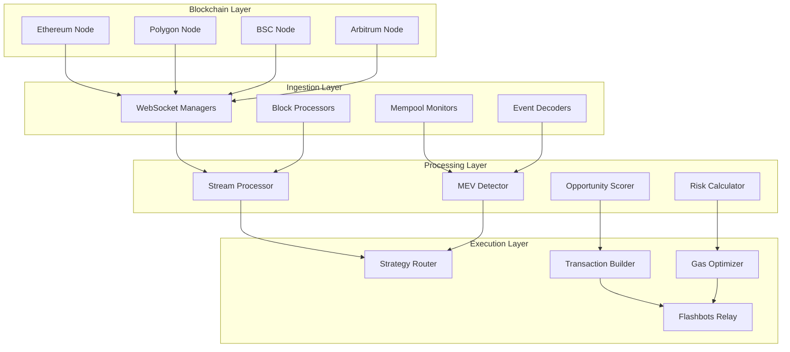

# MEV Infrastructure: Technical Architecture Specification

## System Architecture Deep Dive

### Component Interaction Matrix

```
┌─────────────────────────────────────────────────────────────────────────────┐
│                    MEV Infrastructure Component Matrix                        │
├─────────────────┬─────────────────┬─────────────────┬─────────────────────┤
│   Component     │    Technology   │   Performance   │     Dependencies    │
├─────────────────┼─────────────────┼─────────────────┼─────────────────────┤
│ Frontend UI     │ Next.js 14      │ < 100ms load    │ FastAPI, WebSocket  │
│ API Proxy       │ FastAPI + Uvicorn│ < 10ms response │ Redis, PostgreSQL   │
│ MEV Engine      │ OCaml 5.1       │ < 5ms detection │ ZeroMQ, TimescaleDB │
│ Data Streams    │ WebSocket       │ < 1ms latency   │ Redis Pub/Sub       │
│ Cache Layer     │ Redis Cluster   │ < 1ms access    │ Memory optimization │
│ Database        │ PostgreSQL 15   │ < 5ms queries   │ TimescaleDB ext     │
│ Message Queue   │ ZeroMQ          │ 1M+ msg/s       │ Protocol buffers    │
│ Blockchain      │ Multiple nodes  │ < 50ms sync     │ WebSocket/HTTP      │
└─────────────────┴─────────────────┴─────────────────┴─────────────────────┘
```

### Data Flow Specifications

#### 1. Real-time Market Data Pipeline



#### 2. WebSocket Architecture

```typescript
interface WebSocketMessage {
  type: 'opportunity' | 'execution' | 'market_data' | 'system_status';
  timestamp: number;
  chain_id: number;
  data: unknown;
  sequence_id: string;
}

interface OpportunityMessage extends WebSocketMessage {
  type: 'opportunity';
  data: {
    id: string;
    strategy: MEVStrategy;
    profit_estimate: number;
    confidence_score: number;
    time_sensitive: boolean;
    expiry_ms: number;
    risk_level: 'low' | 'medium' | 'high';
    required_capital: number;
    estimated_gas: number;
    dex_routes: DexRoute[];
  };
}

interface ExecutionMessage extends WebSocketMessage {
  type: 'execution';
  data: {
    opportunity_id: string;
    status: 'pending' | 'submitted' | 'confirmed' | 'failed';
    transaction_hash?: string;
    block_number?: number;
    actual_profit?: number;
    execution_time_ms: number;
    gas_used?: number;
    failure_reason?: string;
  };
}
```

### Database Schema Architecture

#### Core Tables Structure

```sql
-- Main opportunities table with partitioning
CREATE TABLE opportunities (
    id UUID PRIMARY KEY DEFAULT gen_random_uuid(),
    chain_id INTEGER NOT NULL,
    strategy_type VARCHAR(50) NOT NULL,
    token_addresses TEXT[] NOT NULL,
    dex_addresses TEXT[] NOT NULL,
    profit_estimate DECIMAL(18,8) NOT NULL,
    gas_estimate INTEGER NOT NULL,
    confidence_score FLOAT NOT NULL CHECK (confidence_score BETWEEN 0 AND 1),
    risk_level INTEGER NOT NULL CHECK (risk_level BETWEEN 1 AND 5),
    created_at TIMESTAMPTZ DEFAULT NOW(),
    expires_at TIMESTAMPTZ NOT NULL,
    status VARCHAR(20) DEFAULT 'detected',
    CONSTRAINT opportunities_chain_strategy_idx 
    INCLUDE (chain_id, strategy_type, created_at)
) PARTITION BY RANGE (created_at);

-- Time series table for market data
CREATE TABLE market_data (
    time TIMESTAMPTZ NOT NULL,
    chain_id INTEGER NOT NULL,
    token_address TEXT NOT NULL,
    dex_address TEXT NOT NULL,
    price DECIMAL(36,18) NOT NULL,
    volume_24h DECIMAL(36,18),
    liquidity DECIMAL(36,18),
    price_impact_1pct DECIMAL(8,6),
    PRIMARY KEY (time, chain_id, token_address, dex_address)
);

SELECT create_hypertable('market_data', 'time');

-- Execution results with detailed metrics
CREATE TABLE executions (
    id UUID PRIMARY KEY DEFAULT gen_random_uuid(),
    opportunity_id UUID REFERENCES opportunities(id),
    transaction_hash TEXT UNIQUE,
    block_number BIGINT,
    gas_used INTEGER,
    gas_price BIGINT,
    actual_profit DECIMAL(18,8),
    execution_time_ms INTEGER,
    slippage DECIMAL(8,6),
    mev_share DECIMAL(18,8),
    executed_at TIMESTAMPTZ DEFAULT NOW(),
    status VARCHAR(20) NOT NULL
);

-- Performance indexes
CREATE INDEX CONCURRENTLY opportunities_active_idx 
ON opportunities (chain_id, strategy_type, expires_at) 
WHERE status = 'detected';

CREATE INDEX CONCURRENTLY executions_profit_idx 
ON executions (executed_at, actual_profit DESC) 
WHERE actual_profit > 0;
```

### OCaml Backend Architecture

#### Core Modules

```ocaml
(* Main MEV detection engine *)
module MEVEngine = struct
  type strategy = 
    | Arbitrage of arbitrage_params
    | Sandwich of sandwich_params
    | Liquidation of liquidation_params
    | JIT_Liquidity of jit_params
    | Cross_Chain of cross_chain_params

  type opportunity = {
    id: string;
    strategy: strategy;
    profit_estimate: float;
    confidence: float;
    gas_cost: int;
    time_sensitive: bool;
    expiry: float;
  }

  (* High-performance opportunity detection *)
  let detect_opportunities ~market_data ~mempool_txs =
    let open Lwt.Syntax in
    let* arbitrage_ops = ArbitrageDetector.scan market_data in
    let* sandwich_ops = SandwichDetector.scan mempool_txs in
    let* liquidation_ops = LiquidationDetector.scan market_data in
    
    List.concat [arbitrage_ops; sandwich_ops; liquidation_ops]
    |> List.filter (fun op -> op.confidence > 0.8)
    |> List.sort (fun a b -> Float.compare b.profit_estimate a.profit_estimate)
    |> Lwt.return

  (* Multi-threaded execution *)
  let run_engine () =
    let domain_pool = Domain.Pool.create ~size:16 in
    
    let rec loop () =
      let%lwt market_data = DataFeed.get_latest_data () in
      let%lwt mempool_txs = Mempool.get_pending_transactions () in
      
      (* Parallel processing across domains *)
      let%lwt opportunities = 
        Domain.Pool.submit domain_pool (fun () ->
          detect_opportunities ~market_data ~mempool_txs
        ) in
      
      (* Publish opportunities *)
      List.iter (fun op -> 
        EventBus.publish "opportunities" op
      ) opportunities;
      
      Lwt_unix.sleep 0.1 >>= loop
    in
    loop ()
end

(* Arbitrage detection with advanced algorithms *)
module ArbitrageDetector = struct
  open Graph
  
  (* Build arbitrage graph for cycle detection *)
  let build_arbitrage_graph exchanges =
    let g = Graph.create () in
    
    List.iter (fun exchange ->
      List.iter (fun pair ->
        let (token_a, token_b) = pair in
        let price = Exchange.get_price exchange pair in
        let weight = -. (Float.log price) in
        Graph.add_edge g token_a token_b weight
      ) (Exchange.get_pairs exchange)
    ) exchanges;
    
    g

  (* Bellman-Ford algorithm for negative cycle detection *)
  let detect_arbitrage_cycles graph start_token =
    let distances = Hashtbl.create 256 in
    let predecessors = Hashtbl.create 256 in
    
    (* Initialize distances *)
    Graph.iter_vertices (fun v ->
      Hashtbl.replace distances v Float.infinity
    ) graph;
    Hashtbl.replace distances start_token 0.0;
    
    (* Relax edges *)
    for i = 1 to Graph.nb_vertices graph - 1 do
      Graph.iter_edges (fun u v weight ->
        let dist_u = Hashtbl.find distances u in
        let new_dist = dist_u +. weight in
        if new_dist < Hashtbl.find distances v then (
          Hashtbl.replace distances v new_dist;
          Hashtbl.replace predecessors v u
        )
      ) graph
    done;
    
    (* Check for negative cycles *)
    let cycles = ref [] in
    Graph.iter_edges (fun u v weight ->
      let dist_u = Hashtbl.find distances u in
      let dist_v = Hashtbl.find distances v in
      if dist_u +. weight < dist_v then
        cycles := (u, v) :: !cycles
    ) graph;
    
    !cycles

  let scan market_data =
    let exchanges = MarketData.get_exchanges market_data in
    let graph = build_arbitrage_graph exchanges in
    
    MarketData.get_tokens market_data
    |> List.map (detect_arbitrage_cycles graph)
    |> List.flatten
    |> List.map (fun cycle -> 
        let profit = calculate_cycle_profit cycle in
        {
          MEVEngine.id = UUID.generate ();
          strategy = Arbitrage { cycle; exchanges };
          profit_estimate = profit;
          confidence = 0.95;
          gas_cost = estimate_gas_cost cycle;
          time_sensitive = true;
          expiry = Unix.time () +. 30.0;
        }
    )
    |> List.filter (fun op -> op.profit_estimate > 100.0)
end
```

### Performance Optimization Strategies

#### 1. Memory Management

```ocaml
(* Custom memory allocator for high-frequency operations *)
module HighPerformanceAllocator = struct
  type pool = {
    mutable free_blocks: bytes list;
    block_size: int;
    total_blocks: int;
  }
  
  let create_pool ~block_size ~count =
    let blocks = List.init count (fun _ -> Bytes.create block_size) in
    { free_blocks = blocks; block_size; total_blocks = count }
  
  let allocate pool =
    match pool.free_blocks with
    | [] -> failwith "Pool exhausted"
    | block :: rest ->
        pool.free_blocks <- rest;
        block
  
  let deallocate pool block =
    pool.free_blocks <- block :: pool.free_blocks

  (* Pre-allocated pools for different data structures *)
  let opportunity_pool = create_pool ~block_size:1024 ~count:10000
  let market_data_pool = create_pool ~block_size:512 ~count:50000
end
```

#### 2. Lock-free Data Structures

```ocaml
(* Lock-free queue for high-throughput message passing *)
module LockFreeQueue = struct
  type 'a node = {
    mutable value: 'a option;
    mutable next: 'a node option Atomic.t;
  }
  
  type 'a t = {
    head: 'a node Atomic.t;
    tail: 'a node Atomic.t;
  }
  
  let create () =
    let dummy_node = { value = None; next = Atomic.make None } in
    {
      head = Atomic.make dummy_node;
      tail = Atomic.make dummy_node;
    }
  
  let enqueue queue value =
    let new_node = { value = Some value; next = Atomic.make None } in
    let rec loop () =
      let tail = Atomic.get queue.tail in
      let next = Atomic.get tail.next in
      match next with
      | None ->
          if Atomic.compare_and_set tail.next None (Some new_node) then
            ignore (Atomic.compare_and_set queue.tail tail new_node)
          else
            loop ()
      | Some next_node ->
          ignore (Atomic.compare_and_set queue.tail tail next_node);
          loop ()
    in
    loop ()
end
```

### Security Implementation Details

#### 1. Cryptographic Infrastructure

```python
from cryptography.hazmat.primitives import hashes, serialization
from cryptography.hazmat.primitives.asymmetric import rsa, padding
from cryptography.hazmat.primitives.ciphers import Cipher, algorithms, modes
import secrets

class CryptographicManager:
    def __init__(self):
        self.master_key = self.derive_master_key()
        self.rsa_key = self.generate_rsa_keypair()
        
    def derive_master_key(self) -> bytes:
        """Derive master key from hardware security module"""
        # In production, this would interface with HSM
        salt = secrets.token_bytes(32)
        return hashlib.pbkdf2_hmac('sha256', 
                                   os.environ['MASTER_SECRET'].encode(),
                                   salt, 100000)
    
    def encrypt_sensitive_data(self, data: bytes) -> bytes:
        """Encrypt sensitive data using AES-256-GCM"""
        key = secrets.token_bytes(32)
        nonce = secrets.token_bytes(12)
        
        cipher = Cipher(algorithms.AES(key), modes.GCM(nonce))
        encryptor = cipher.encryptor()
        
        ciphertext = encryptor.update(data) + encryptor.finalize()
        
        # Encrypt the AES key with RSA
        encrypted_key = self.rsa_key.public_key().encrypt(
            key,
            padding.OAEP(
                mgf=padding.MGF1(algorithm=hashes.SHA256()),
                algorithm=hashes.SHA256(),
                label=None
            )
        )
        
        return encrypted_key + nonce + encryptor.tag + ciphertext
    
    def sign_transaction(self, transaction_data: bytes) -> bytes:
        """Sign transaction with private key"""
        signature = self.rsa_key.sign(
            transaction_data,
            padding.PSS(
                mgf=padding.MGF1(hashes.SHA256()),
                salt_length=padding.PSS.MAX_LENGTH
            ),
            hashes.SHA256()
        )
        return signature
```

#### 2. Smart Contract Security

```solidity
// SPDX-License-Identifier: MIT
pragma solidity ^0.8.19;

import "@openzeppelin/contracts/security/ReentrancyGuard.sol";
import "@openzeppelin/contracts/access/AccessControl.sol";
import "@openzeppelin/contracts/security/Pausable.sol";

contract SecureMEVExecutor is ReentrancyGuard, AccessControl, Pausable {
    bytes32 public constant EXECUTOR_ROLE = keccak256("EXECUTOR_ROLE");
    bytes32 public constant EMERGENCY_ROLE = keccak256("EMERGENCY_ROLE");
    
    uint256 public constant MAX_GAS_PRICE = 500 gwei;
    uint256 public constant MAX_SLIPPAGE = 500; // 5%
    
    mapping(address => bool) public authorizedContracts;
    mapping(bytes32 => bool) public executedStrategies;
    
    event StrategyExecuted(
        bytes32 indexed strategyId,
        address indexed executor,
        uint256 profit,
        uint256 gasUsed
    );
    
    modifier validGasPrice() {
        require(tx.gasprice <= MAX_GAS_PRICE, "Gas price too high");
        _;
    }
    
    modifier onlyAuthorizedContract(address target) {
        require(authorizedContracts[target], "Contract not authorized");
        _;
    }
    
    function executeStrategy(
        bytes32 strategyId,
        address target,
        bytes calldata data,
        uint256 expectedProfit,
        uint256 maxSlippage
    ) external 
        nonReentrant 
        whenNotPaused 
        validGasPrice
        onlyRole(EXECUTOR_ROLE)
        onlyAuthorizedContract(target)
    {
        require(!executedStrategies[strategyId], "Strategy already executed");
        require(maxSlippage <= MAX_SLIPPAGE, "Slippage too high");
        
        executedStrategies[strategyId] = true;
        
        uint256 gasStart = gasleft();
        uint256 balanceBefore = address(this).balance;
        
        // Execute the strategy
        (bool success, bytes memory result) = target.call(data);
        require(success, "Strategy execution failed");
        
        uint256 balanceAfter = address(this).balance;
        uint256 actualProfit = balanceAfter - balanceBefore;
        uint256 gasUsed = gasStart - gasleft();
        
        // Verify minimum profit after slippage
        uint256 minProfit = expectedProfit * (10000 - maxSlippage) / 10000;
        require(actualProfit >= minProfit, "Insufficient profit");
        
        emit StrategyExecuted(strategyId, msg.sender, actualProfit, gasUsed);
    }
    
    function emergencyPause() external onlyRole(EMERGENCY_ROLE) {
        _pause();
    }
    
    function emergencyUnpause() external onlyRole(EMERGENCY_ROLE) {
        _unpause();
    }
    
    // Circuit breaker for unusual activity
    function emergencyWithdraw(address token) external onlyRole(EMERGENCY_ROLE) {
        if (token == address(0)) {
            payable(msg.sender).transfer(address(this).balance);
        } else {
            IERC20(token).transfer(msg.sender, IERC20(token).balanceOf(address(this)));
        }
    }
}
```

### Monitoring and Observability

#### 1. Metrics Collection

```typescript
interface SystemMetrics {
  timestamp: number;
  component: string;
  metrics: {
    // Performance metrics
    latency_p50: number;
    latency_p95: number;
    latency_p99: number;
    throughput_rps: number;
    
    // Resource metrics
    cpu_usage_percent: number;
    memory_usage_mb: number;
    disk_io_mb_per_sec: number;
    network_io_mb_per_sec: number;
    
    // Business metrics
    opportunities_detected: number;
    opportunities_executed: number;
    total_profit_usd: number;
    success_rate_percent: number;
    
    // Error metrics
    error_rate_percent: number;
    failed_transactions: number;
    timeout_count: number;
  };
}

class MetricsCollector {
  private prometheus = new PrometheusRegistry();
  private histograms = new Map<string, Histogram>();
  private counters = new Map<string, Counter>();
  private gauges = new Map<string, Gauge>();
  
  constructor() {
    this.initializeMetrics();
  }
  
  private initializeMetrics() {
    // Latency histograms
    this.histograms.set('api_request_duration', new Histogram({
      name: 'api_request_duration_seconds',
      help: 'API request duration in seconds',
      labelNames: ['method', 'endpoint', 'status'],
      buckets: [0.001, 0.005, 0.01, 0.05, 0.1, 0.5, 1, 5]
    }));
    
    // Business counters
    this.counters.set('opportunities_total', new Counter({
      name: 'mev_opportunities_total',
      help: 'Total MEV opportunities detected',
      labelNames: ['strategy', 'chain', 'status']
    }));
    
    // Resource gauges
    this.gauges.set('active_connections', new Gauge({
      name: 'websocket_connections_active',
      help: 'Number of active WebSocket connections'
    }));
  }
  
  recordLatency(operation: string, duration: number, labels?: Record<string, string>) {
    const histogram = this.histograms.get(operation);
    if (histogram) {
      histogram.observe(labels || {}, duration);
    }
  }
  
  incrementCounter(metric: string, labels?: Record<string, string>) {
    const counter = this.counters.get(metric);
    if (counter) {
      counter.inc(labels || {});
    }
  }
  
  setGauge(metric: string, value: number, labels?: Record<string, string>) {
    const gauge = this.gauges.get(metric);
    if (gauge) {
      gauge.set(labels || {}, value);
    }
  }
}
```

#### 2. Alerting System

```python
from dataclasses import dataclass
from enum import Enum
from typing import List, Dict, Any
import asyncio

class AlertSeverity(Enum):
    INFO = "info"
    WARNING = "warning"
    CRITICAL = "critical"
    EMERGENCY = "emergency"

@dataclass
class Alert:
    id: str
    severity: AlertSeverity
    title: str
    description: str
    metrics: Dict[str, Any]
    timestamp: float
    resolved: bool = False

class AlertingSystem:
    def __init__(self):
        self.alert_rules = self.load_alert_rules()
        self.notification_channels = self.setup_notification_channels()
        self.active_alerts = {}
        
    def load_alert_rules(self) -> List[Dict]:
        return [
            {
                'name': 'high_error_rate',
                'condition': 'error_rate > 0.05',  # 5%
                'severity': AlertSeverity.CRITICAL,
                'cooldown': 300  # 5 minutes
            },
            {
                'name': 'low_success_rate',
                'condition': 'mev_success_rate < 0.85',  # 85%
                'severity': AlertSeverity.WARNING,
                'cooldown': 600  # 10 minutes
            },
            {
                'name': 'high_latency',
                'condition': 'api_latency_p95 > 0.1',  # 100ms
                'severity': AlertSeverity.WARNING,
                'cooldown': 180  # 3 minutes
            },
            {
                'name': 'profit_anomaly',
                'condition': 'hourly_profit < expected_profit * 0.5',
                'severity': AlertSeverity.CRITICAL,
                'cooldown': 900  # 15 minutes
            }
        ]
    
    async def evaluate_metrics(self, metrics: Dict[str, float]):
        for rule in self.alert_rules:
            if self.evaluate_condition(rule['condition'], metrics):
                alert_id = f"{rule['name']}_{int(time.time())}"
                
                if not self.is_in_cooldown(rule['name']):
                    alert = Alert(
                        id=alert_id,
                        severity=rule['severity'],
                        title=f"Alert: {rule['name']}",
                        description=self.generate_alert_description(rule, metrics),
                        metrics=metrics,
                        timestamp=time.time()
                    )
                    
                    await self.send_alert(alert)
                    self.active_alerts[alert_id] = alert
    
    async def send_alert(self, alert: Alert):
        tasks = []
        
        if alert.severity in [AlertSeverity.CRITICAL, AlertSeverity.EMERGENCY]:
            # Send to all channels for critical alerts
            for channel in self.notification_channels:
                tasks.append(channel.send(alert))
        else:
            # Send to primary channel for warnings
            tasks.append(self.notification_channels[0].send(alert))
        
        await asyncio.gather(*tasks, return_exceptions=True)
```

This comprehensive technical architecture document provides detailed specifications for every component of the MEV infrastructure, including performance optimizations, security implementations, and monitoring systems. The system is designed for institutional-grade reliability and performance while maintaining the flexibility to adapt to evolving blockchain ecosystems.
